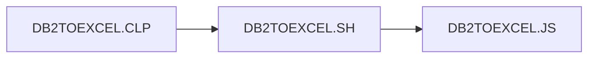

## Source Code



```CLP title="DB2TOEXCEL.CLP"
PGM
QSH        CMD('/QOpenSys/usr/bin/sh -c +
            "/home/max/builds/AS400_MaxTool/Node_JS/DB2+
            TOExcel.sh"')
endpgm
```

```Shell title="DB2TOEXCEL.SH"
export PATH=/QOpenSys/pkgs/lib/nodejs14/bin:/QOpenSys/pkgs/bin:$PATH
node -v
node /home/max/builds/AS400_MaxTool/Node_JS/DB2toExcel.js
```

```JS title="DB2TOEXCEL.JS"
const { Connection, Statement, } = require('idb-pconnector');
const Excel = require('exceljs');

async function generateExcel() {
    // Create connection with DB2
    const connection = new Connection({ url: '*LOCAL' });
    const statement = new Statement(connection);
    const sql = 'SELECT CUSNUM, LSTNAM, BALDUE, CDTLMT FROM QIWS.QCUSTCDT'

    // Execute the statement to fetch data in results
    const results = await statement.exec(sql);

    // Create Excel workbook and worksheet
    const workbook = new Excel.Workbook();
    const worksheet = workbook.addWorksheet('Customers');

    // Define columns in the worksheet, these columns are identified using a key.
    worksheet.columns = [
        { header: 'Id', key: 'CUSNUM', width: 10 },
        { header: 'Last Name', key: 'LSTNAM', width: 10 },
        { header: 'Balance Due', key: 'BALDUE', width: 11 },
        { header: 'Credit Limit', key: 'CDTLMT', width: 10 }
    ];

    // Add rows from database to worksheet
    for (const row of results) {
        worksheet.addRow(row);
    }

    // Add autofilter on each column
    worksheet.autoFilter = 'A1:D1';

    // Process each row for calculations and beautification
    worksheet.eachRow((row, rowNumber) => {

        row.eachCell((cell, colNumber) => {
            if (rowNumber == 1) {
                // First set the background of header row
                cell.fill = {
                    type: 'pattern',
                    pattern: 'solid',
                    fgColor: { argb: 'f5b914' }
                };
            };
            // Set border of each cell
            cell.border = {
                top: { style: 'thin' },
                left: { style: 'thin' },
                bottom: { style: 'thin' },
                right: { style: 'thin' }
            };
        });
        //Commit the changed row to the stream
        row.commit();
    });

    //Process 'Balance Due' column for conditioning
    const balDue = worksheet.getColumn('BALDUE');
    // Iterate over all current cells in this column
    balDue.eachCell((cell, rowNumber) => {
        // If the balance due is 400 or more, highlight it with gradient color
        if (cell.value >= 400) {
            cell.fill = {
                type: 'gradient',
                gradient: 'angle',
                degree: 0,
                stops: [
                    { position: 0, color: { argb: 'ffffff' } },
                    { position: 0.5, color: { argb: 'cc8188' } },
                    { position: 1, color: { argb: 'fa071e' } }
                ]
            };
        };
    });

    // Write the final excel file in the folder from where we are running the code.
    await workbook.xlsx.writeFile('Customers.xlsx');
}

// Call the generateExcel function
generateExcel().catch((error) => {
    console.error(error);
});
```
