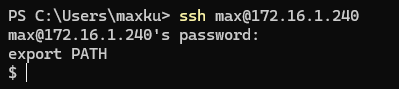
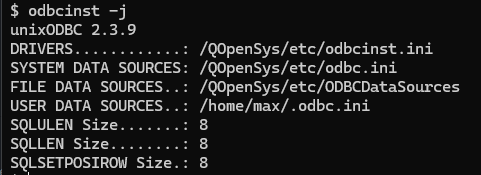
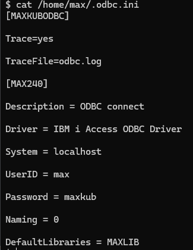
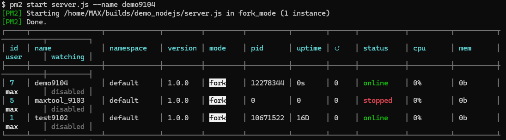
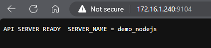
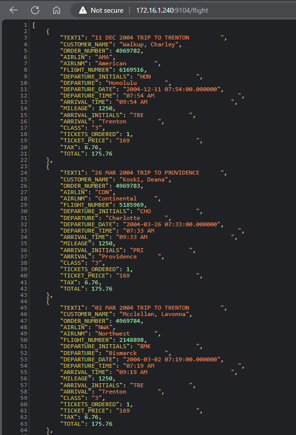
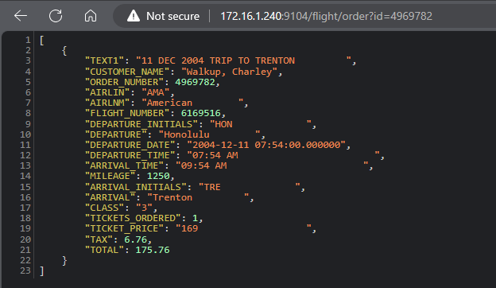

## ODBC in AS400

SSH to AS400 <br/>
<br/>
<br/>
<br/>

## Nodejs

``` env title=".env"
SERVER_PORT=9104
SERVER_NAME=demo_nodejs
CONNECTION_STRING=MAX240
```

``` js title="server.js"
const fastify = require("fastify")();

require("dotenv").config();
const path = require("path");
const fs = require("fs");
const port = parseInt(process.env.SERVER_PORT);

fastify.register(require("@fastify/cors"), {});

fastify.get(
  "/",
  () => `API SERVER READY  SERVER_NAME = ${process.env.SERVER_NAME || ""}`
);

fastify.register(require("@fastify/static"), {
  root: path.join(__dirname, "upload"),
  prefix: "/public/",
});

//Flight Inquiry
fastify.register(require("./routes"), {
  prefix: "/flight",
});

// * Run the server
fastify
  .listen({ port, host: "0.0.0.0" })
  .then((address) => {
    console.log(`server listening on ${address}`);
  })
  .catch((err) => {
    console.log("Error starting server:", err);
    process.exit(1);
  });
```

``` js title="routes.js"
const loadAll = require("./loaddata");
const getOne = require("./getByid");

const routes = (fastify, options, done) => {
  fastify.get("/", loadAll.loaddata);

  fastify.get("/order:ID", getOne.loadByid);

  done();
};

module.exports = routes;
```

``` js title="loaddata.js"
const connection = require("./server");
const odbc = require("odbc");

exports.loaddata = (req, res) => {
  //connect Database
  const cn = `DSN=${process.env.CONNECTION_STRING}`;
  odbc.connect(cn, (err, connection) => {
    connection.query(
      `select varchar_format(flght400.orders.departure_date, 'dd MON YYYY') || ' TRIP TO ' || Upper(flght400.flights.ARRIVAL) as text1 , flght400.customers.customer_name,
      flght400.orders.order_number,
      FLGHT400.AIRLINE.AIRLIN,
      FLGHT400.AIRLINE.AIRLNM,
      flght400.orders.flight_number,
      flght400.flights.DEPARTURE_INITIALS,
      flght400.flights.DEPARTURE,
      flght400.orders.DEPARTURE_DATE,
      flght400.flights.departure_time,
      flght400.flights.ARRIVAL_TIME,
      flght400.flights.MILEAGE,
      flght400.flights.ARRIVAL_INITIALS,
      flght400.flights.ARRIVAL,
      flght400.orders.class,
      flght400.orders.TICKETS_ORDERED,
      flght400.flights.TICKET_PRICE,
      cast(flght400.flights.TICKET_PRICE as int) * 0.04 as tax ,
      cast(flght400.flights.TICKET_PRICE as int) + (cast(flght400.flights.TICKET_PRICE as int) * 0.04) as total 
      from flght400.orders 
      join flght400.flights on flght400.orders.flight_number = flght400.flights.flight_number
      join flght400.customers on flght400.orders.customer_no = flght400.customers.customer_no
      join flght400.airline on flght400.airline.airlin = FLGHT400.FLIGHTS.airlines fetch first 10000 rows only `,
      (error, result) => {
        if (error) {
          throw error;
        }
        res.code(200).send(result);
      }
    );
  });
};
```

``` js title="getbyid.js"
const connection = require("./server");
const odbc = require("odbc");

exports.loadByid = (req, res) => {
  //connect Database
  const orderNo = req.query.id;
  const cn = `DSN=${process.env.CONNECTION_STRING}`;
  odbc.connect(cn, (err, connection) => {
    connection.query(
      `select varchar_format(flght400.orders.departure_date, 'dd MON YYYY') || ' TRIP TO ' || Upper(flght400.flights.ARRIVAL) as text1 , flght400.customers.customer_name,
        flght400.orders.order_number,
        FLGHT400.AIRLINE.AIRLIN,
        FLGHT400.AIRLINE.AIRLNM,
        flght400.orders.flight_number,
        flght400.flights.DEPARTURE_INITIALS,
        flght400.flights.DEPARTURE,
        flght400.orders.DEPARTURE_DATE,
        flght400.flights.departure_time,
        flght400.flights.ARRIVAL_TIME,
        flght400.flights.MILEAGE,
        flght400.flights.ARRIVAL_INITIALS,
        flght400.flights.ARRIVAL,
        flght400.orders.class,
        flght400.orders.TICKETS_ORDERED,
        flght400.flights.TICKET_PRICE,
        cast(flght400.flights.TICKET_PRICE as int) * 0.04 as tax ,
        cast(flght400.flights.TICKET_PRICE as int) + (cast(flght400.flights.TICKET_PRICE as int) * 0.04) as total 
        from flght400.orders 
        join flght400.flights on flght400.orders.flight_number = flght400.flights.flight_number
        join flght400.customers on flght400.orders.customer_no = flght400.customers.customer_no
        join flght400.airline on flght400.airline.airlin = FLGHT400.FLIGHTS.airlines
        where flght400.orders.ORDER_NUMBER = ${orderNo} `,
      (error, result) => {
        if (error) {
          throw error;
        }
        res.code(200).send(result);
      }
    );
  });
};
```

## Run Nodejs by PM2

```bash
pm2 start server.js --name demo9104
```



## Result

Test port 9104 : http://172.16.1.240:9104/



GET all data : http://172.16.1.240:9104/flight



GET by order : http://172.16.1.240:9104/flight/order?id=4969782

