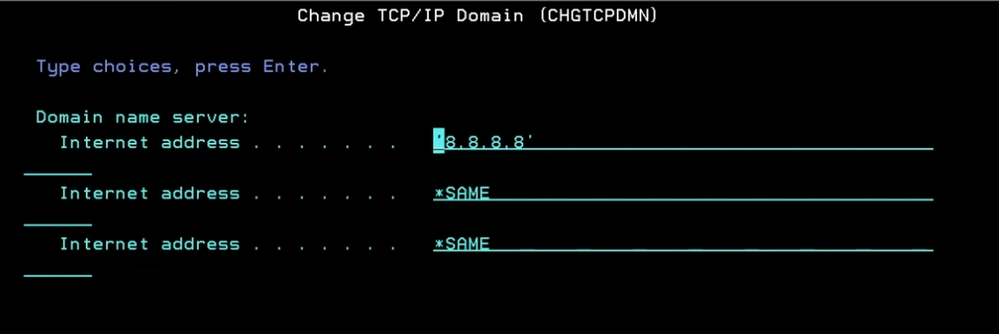

## install YUM

link : [ https://bitbucket.org/ibmi/opensource/src/20192a55b76d99a839815f61100e427ac75cdd11/docs/yum/#markdown-header-offline-install-instructions-without-acs ]

- Download bootstrap.sh and bootstrap.tar.Z to your PC
- Upload bootstrap.sh and bootstrap.tar.Z to your IBM i

```shell
scp -r ./bootstrap.sh ./bootstrap.tar.Z ibmi@192.168.1.10:/tmp
```

- From a 5250 terminal run the following.

```shell
QSH CMD('touch -C 819 /tmp/bootstrap.log; /QOpenSys/usr/bin/ksh /tmp/bootstrap.sh > /tmp/bootstrap.log 2>&1')
```

- check the log file

```shell
cat /tmp/bootstrap.log
```

- check the /QOpenSys/etc must found **_yum_** Use for online
- check the /QOpenSys/pkgs/lib must found **_rpm_** Use for offine
- check repo for yum in /QOpenSys/etc/yum

```shell
cat /QOpenSys/etc/yum/repos.d/ibmi-base.repo
```

## Export PATH

```shell
cd /QOpenSys/etc/profile         *for all user profile
cd /home/max/.profile            *for user profile max

touch .profile
echo 'PATH=/QOpenSys/pkgs/bin:$PATH' >> .profile
echo 'export PATH' >> .profile
export PATH=/QOpenSys/pkgs/lib/
```

## Export PATH for Global

```shell
touch /QOpenSys/etc/profile
setccsid 1208 /QOpenSys/etc/profile
echo 'PATH=/QOpenSys/pkgs/bin:$PATH' >> /QOpenSys/etc/profile
echo 'export PATH' >> /QOpenSys/etc/profile
echo PATH=/QOpenSys/pkgs/lib/nodejsxx/lib/node_modules/pm2/bin:$PATH >> /QOpenSys/etc/profile
echo 'export PATH' >> /QOpenSys/etc/profile
```

## Install opensource via online

```shell
yum install -y opensource
```

## Install opensource via offine

link for download : [ https://public.dhe.ibm.com/software/ibmi/products/pase/rpms/repo-base-7.3/ppc64/ ]

```shell
rpm -i filename.rpm

### before unixODBC-2.3.9-1.ppc64
rpm -i grep-gnu-3.0-2.ibmi7.2.ppc64.rpm
rpm -i libtool-2.4.6-5.ibmi7.2.ppc64.rpm
rpm -i libodbc2-2.3.9-1.ibmi7.2.ppc64.rpm

rpm -i unixODBC-2.3.9-1.ppc64.rpm
```

## Install PM2

```shell
npm install -g pm2

##create .PM2
cd /QopenSys/pkgs/lib/nodejs20/lib/node_modules/pm2/bin
pm2 list

##set $PATH
echo PATH=/QOpenSys/pkgs/lib/nodejs20/lib/node_modules/pm2/bin:$PATH >> .profile
echo 'export PATH' >> .profile
```

## Test NodeJS

```shell
cd /www/apachedft/htdocs
touch node.js
npm init
```

```javascript title='EXAMPLE'
// server.mjs
var http = require("http");

http
  .createServer(function (req, res) {
    res.writeHead(200, { "Content-Type": "text/plain" });
    res.end("Hello World!");
  })
  .listen(8080);
```

```javascript title='EXAMPLE2'
// server.mjs
import { createServer } from "node:http";

const server = createServer((req, res) => {
  res.writeHead(200, { "Content-Type": "text/plain" });
  res.end("Hello World!\n");
});

// starts a simple http server locally on port 3000
server.listen(3000, "127.0.0.1", () => {
  console.log("Listening on 127.0.0.1:3000");
});

// run with `node server.mjs`
```

## Command use

```shell
yum install -y [opensource]
rpm -i [filename.rpm]
ps -ef
kill [PID]
yum list
yum-config-manager
yum-config-manager --add-repo https://public.dhe.ibm.com/software/ibmi/products/pase/rpms/repo/
```

## Error Resovle DNS

```shell
CFGTCP
OPTION 12
Set DNS

or
Option 10 by command "ADDTCPHTE INTNETADR('129.35.224.112') HOSTNAME((public.dhe.ibm.com))"

**(Recommend Opt 12)
```



## VDO Install Meeting

| ตอนที่ | หัวข้อ                                             |             วีดีโอ             |
| :----: | -------------------------------------------------- | :----------------------------: |
|   1    | Metro : Install Node on ibm i Via Offline          | [https://youtu.be/4QV_ifBgXuc] |
|   2    | TCCC : Install Node and pyghon on ibm i Via Online | [https://youtu.be/n32ljoQEblI] |

## Install PHPCOM

Document : [Download](./assets/Install%20PHP%20Community[56]%20%20-%20%20Read-Only.pptx)

### Add Seiden Repo

```bash
yum-config-manager --add-repo https://repo.seidengroup.com/repo/stable/seiden_stable.repo
```

### PHP Installation list

```text
php-bcmath
php-bz2
php-calendar
php-cli
php-common
php-composer
php-ctype
php-curl
php-devel
php-exif
php-fileinfo
php-fpm
php-ftp
php-gd
php-gettext
php-gmp
php-ibmi
php-iconv
php-imagick
php-imap
php-intl
php-ldap
php-mbstring
php-mcrypt
php-mongodb
php-mysqlnd
php-odbc
php-opcache
php-openssl
php-pdo
php-pdo_dblib
php-pear
php-pgsql
php-phar
php-process
php-readline
php-redis
php-soap
php-sockets
php-sodium
php-sqlite3
php-ssh2
php-tidy
php-tokenizer
php-toolkit
php-xdebug
php-xml
php-zendframework1
php-zip
php-pdo_ibm
php-ibm_db2
```
