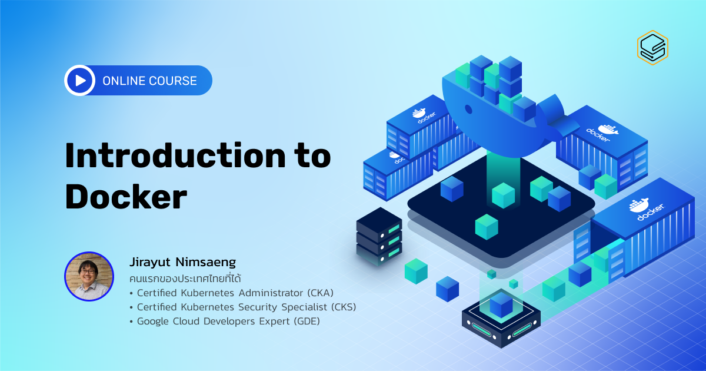

[Docker คืออะไร คลิก !!](https://blog.skooldio.com/what-is-docker/)

DevSecOps เป็นแนวคิดที่จะช่วยให้องค์กรของคุณ พัฒนา software ให้กับผู้ใช้งานได้รวดเร็ว และปลอดภัยมากยิ่งขึ้นในทุก step การทำงาน ซึ่ง Docker เป็นหนึ่งในเครื่องมือในการทำ DevSecOps ที่หลากหลายองค์กรนิยมใช้งาน ซึ่งจะทำให้การ Deploy Application ขององค์กรคุณง่ายขึ้น เร็วขึ้นกว่าที่เคย

สิ่งที่จะได้รับจากคอร์สนี้
ในคอร์ส Introduction to Docker คุณจะได้เรียนรู้ตั้งแต่

- ทฤษฎีเบื้องต้นว่า Docker คืออะไร แตกต่างหรือเหมือนกับ Virtual Machine หรือไม่อย่างไร
- คอนเซปต์ของ Docker ในการทำ BUILD, SHIP, RUN ที่ทุกคนต้องรู้มีอะไรบ้าง
- ลองนำ application ขึ้นจริงตั้งแต่ command พื้นฐานของ Docker ขั้นตอนการนำเอา application source code มาแปลงให้เป็น Docker Container ไปจนถึงการรัน application แบบซับซ้อนด้วย Docker Compose

โดยหลังจากเรียนจบหลักสูตร คุณจะสามารถนำ application ของคุณมาแปลงเป็น Container และ Docker Compose เพื่อใช้งานได้ทันที

### Course Introduction

| ตอนที่ | หัวข้อ              |             วีดีโอ             |
| :----: | ------------------- | :----------------------------: |
|   1    | Course Introduction | [https://youtu.be/KccVAJOQRUg] |

### Get to Know Docker

[Download Doc](<./Document/devops_introduction-to-docker/(2.1)%20Course%20Material%20.pdf>)

| ตอนที่ | หัวข้อ                        |             วีดีโอ             |
| :----: | ----------------------------- | :----------------------------: |
|   1    | What is Docker?               | [https://youtu.be/LZZPZC6BCAc] |
|   2    | Virtual Machine or Container? | [https://youtu.be/A89AjQ0ovc8] |
|   3    | Where Docker can run          | [https://youtu.be/EBXXWosV7w4] |

### Docker Concepts: Build, Ship and Run

| ตอนที่ | หัวข้อ                           |             วีดีโอ             |
| :----: | -------------------------------- | :----------------------------: |
|   1    | Docker Image                     | [https://youtu.be/apRAt_gGGww] |
|   2    | Docker Container & Docker Engine | [https://youtu.be/NVSFoMqlhPI] |
|   3    | Docker Registry                  | [https://youtu.be/5qBRyUyJvmU] |

### Basic Docker Commands

| ตอนที่ | หัวข้อ                    |             วีดีโอ             |
| :----: | ------------------------- | :----------------------------: |
|   1    | Docker Architecture       | [https://youtu.be/E70pRHUNEbI] |
|   2    | Docker Image Commands     | [https://youtu.be/SLiZj9PtOZQ] |
|   3    | Docker Container Commands | [https://youtu.be/6LZy4pYFgek] |
|   4    | Running Docker Container  | [https://youtu.be/82dg5vx6GW8] |
|   5    | Utilities Commands I      | [https://youtu.be/LdSqSHE9Tq4] |
|   6    | Utilities Commands II     | [https://youtu.be/t2jR1cvMx_k] |
|   7    | Utilities Commands III    | [https://youtu.be/_1vBux2sjZU] |

### Workshop

| ตอนที่ | หัวข้อ                                    |             วีดีโอ             |
| :----: | ----------------------------------------- | :----------------------------: |
|   1    | Application Overview                      | [https://youtu.be/HyYWPeQSWyE] |
|   2    | Running Application in Docker             | [https://youtu.be/32wvc1WapVo] |
|   3    | Linking Docker Containers                 | [https://youtu.be/HBEgogxxlhQ] |
|   4    | Initialize data in MongoDB (Mount volume) | [https://youtu.be/Om4ngCh1yIw] |

### Docker Compose

| ตอนที่ | หัวข้อ             |             วีดีโอ             |
| :----: | ------------------ | :----------------------------: |
|   1    | Docker Compose I   | [https://youtu.be/jOzfhSeiQ3o] |
|   2    | Docker Compose II  | [https://youtu.be/LH8Uh1C6GAs] |
|   3    | Docker Compose III | [https://youtu.be/o5geNgv1c8M] |

### Conclusion

| ตอนที่ | หัวข้อ           |             วีดีโอ             |
| :----: | ---------------- | :----------------------------: |
|   1    | Docker Compose I | [https://youtu.be/IkruK2TcpKY] |
