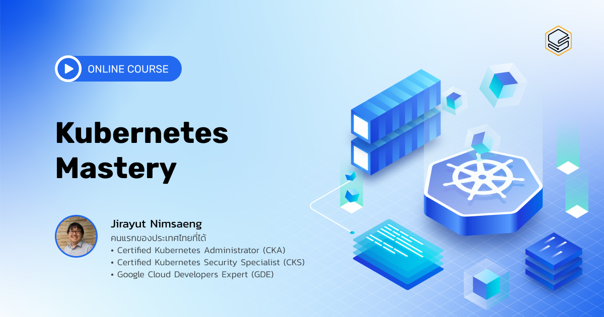

ทำไมต้อง Kubernetes?
หลายองค์กร เวลาต้องการ Deploy Application ลง Kubernetes นั้น จะต้องเสียทรัพยากร DevOps และเวลาในการวิจัย และศึกษา Kubernetes เป็นจำนวนมาก อาจจะมีการลองผิดลองถูกหลายรอบ จนกว่าจะออกมาเป็น Best Practice หรือแม้แต่ไม่รู้เลยว่าจะจับต้นชนปลายในการ Deploy Application ตนเองอย่างไรดี

คอร์สออนไลน์ Introduction to Kubernetes นี้ จึงถูกออกแบบมาเพื่อย่นระยะเวลาในการศึกษา และลองผิดลองถูกในการ Deploy Application ลง Kubernetes สำหรับทั้ง DevOps ที่รู้จัก หรืออยากจะรู้จัก Kubernetes ก็ตาม

ทุกคนจะได้เรียนรู้ผ่านการลงมือทำจริง ตั้งแต่พื้นฐานของ Kubernetes และ Helm ไปจนถึงการ Deploy Application ลง Kubernetes แล้วนำไปประยุกต์ใช้กับ Helm และเข้าใจการทำงานของ Kubernetes และ Helm ซึ่งจะช่วยให้ทุกคนสามารถนำความรู้ที่ได้ไปประยุกต์ใช้กับงานของตัวเองได้อย่างรวดเร็ว และมีประสิทธิภาพสูงสุด

ในคอร์ส Introduction to Kubernetes นี้คุณจะ

- สามารถ Deploy Application ลงบน Kubernetes แบบ Best Practice ได้
- สามารถนำเทคนิคการใช้ Kubernetes ที่เรียนมาใช้ได้โดยไม่ต้องเสียเวลาลองผิดลองถูก
- สามารถดูแล และ Troubleshoot Kubernetes พื้นฐานได้

### Instructor & Course Introduction

| ตอนที่ | หัวข้อ                           |             วีดีโอ             |
| :----: | -------------------------------- | :----------------------------: |
|   1    | Instructor & Course Introduction | [https://youtu.be/LV-VPMAB2qg] |

### Get to Know Kubernetes

| ตอนที่ | หัวข้อ                           |
| :----: | -------------------------------- |
|   1    | Intro to Docker                  |
|   2    | Intro to Kubernetes              |
|   3    | Architecture & Distribution      |
|   4    | Concept I : Pods                 |
|   5    | Concept II : Node Port           |
|   6    | Concept III : ClusterIP          |
|   7    | Concept IV : Ingress             |
|   8    | Concept V : Labels and Selectors |
|   9    | Manifest File                    |

VDO : [https://youtu.be/yAtHXdZXN-4]

### Introduction to Helm

| ตอนที่ | หัวข้อ         |
| :----: | -------------- |
|   1    | Intro to Helm  |
|   2    | Helm           |
|   3    | Helm Structure |

VDO : [https://youtu.be/xVZIDfOb09w]

### Best Practise

| ตอนที่ | หัวข้อ                                |
| :----: | ------------------------------------- |
|   1    | Health Check                          |
|   2    | Resource Request and Limit            |
|   3    | Ingress with TLS                      |
|   4    | Kubernetes Troubleshooting            |
|   5    | Kubernetes Persistent Volume I        |
|   6    | Kubernetes Persistent Volume II       |
|   7    | Kubernetes Persistent Volume III      |
|   8    | Kubernetes Persistent Volume Claim I  |
|   9    | Kubernetes Persistent Volume Claim II |

VDO : [https://youtu.be/CLGraHRpO7g]

### Workshop

- ไฟล์สำหรับ Workshop : [https://drive.google.com/file/d/1LV662UyNwQDLTWMPLravbyFEhePTs7ZE/view]
- ดูวิธีการเข้าใช้งาน google cloud : [https://cloud.google.com/kubernetes-engine/docs/deploy-app-cluster]

| ตอนที่ | หัวข้อ                                   |             วีดีโอ             |
| :----: | ---------------------------------------- | :----------------------------: |
|   1    | Workshop Overview                        | [https://youtu.be/cFsueWb-XeE] |
|   2    | Prerequisite                             | [https://youtu.be/fy_7NS8nRTM] |
|   3    | Preparation                              | [https://youtu.be/EKT_o6wUKU0] |
|   4    | Kubernetes Command Line I                | [https://youtu.be/NHkU9uDy-_w] |
|   5    | Kubernetes Command Line II               | [https://youtu.be/UfeSkeM9ghA] |
|   6    | Kubernetes Command Line III              | [https://youtu.be/VrEO5ElK5m0] |
|   7    | Kubernetes Command Line IV               | [https://youtu.be/e9W0FbaFscE] |
|   8    | Kubernetes Manifest File I               | [https://youtu.be/JyZQY19CZlY] |
|   9    | Kubernetes Manifest File II              | [https://youtu.be/VIZGRlPq7JM] |
|   10   | Deploy Rating Service on K8s I           | [https://youtu.be/VZCEMpiScng] |
|   11   | Deploy Rating Service on K8s II          | [https://youtu.be/ty5B0d6m4rg] |
|   12   | Deploy MongoDB with Helm I               | [https://youtu.be/QtMFHN5JCFU] |
|   13   | Deploy MongoDB with Helm II              | [https://youtu.be/ijzgYunAq80] |
|   14   | Deploy MongoDB with Helm III             | [https://youtu.be/SI5B_FdTiNs] |
|   15   | Deploy MongoDB with Helm IV              | [https://youtu.be/lYkDOIxf7iI] |
|   16   | Convert Rating Service to Helm Chart I   | [https://youtu.be/34lcstRsWA4] |
|   17   | Convert Rating Service to Helm Chart II  | [https://youtu.be/CSrzHCbomos] |
|   18   | Convert Rating Service to Helm Chart III | [https://youtu.be/WrDLi6SG2rI] |
|   19   | Convert Rating Service to Helm Chart IV  | [https://youtu.be/97VcU98OBp0] |

### Conclusion

| ตอนที่ | หัวข้อ     |             วีดีโอ             |
| :----: | ---------- | :----------------------------: |
|   1    | Conclusion | [https://youtu.be/8SwG3UKeYc8] |
