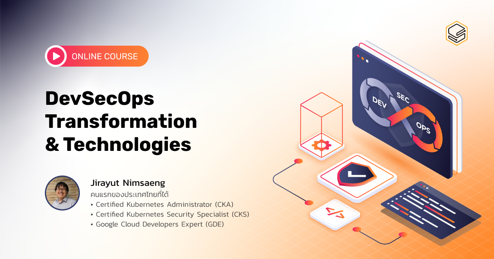

DevSecOps สำคัญกับยุคสมัยนี้อย่างไร?

ในยุคที่เทคโนโลยีเข้ามามีบทบาททางธุรกิจอย่างมาก ความรวดเร็วในการขยับตัวของธุรกิจหลายครั้งผูกอยู่กับความเร็วของการพัฒนา software องค์กรไหนที่ส่งมอบประสบการณ์ที่ใหม่ ดี และปลอดภัยให้ลูกค้าได้บ่อยกว่าคู่แข่งย่อมได้เปรียบทางธุรกิจ

[DevSecOps เป็นแนวคิดที่จะช่วยให้องค์กรของคุณ](https://blog.skooldio.com/what-is-devsecops/) พัฒนา Software ให้กับผู้ใช้งานได้รวดเร็วยิ่งขึ้น ทั้งยังมี Security ในรูปแบบ Automation แทรกเข้าไปยังทุกขั้นตอนของ DevOps เพื่อเพิ่มประสิทธิภาพการทำงานของทั้งทีม Developer Security และ Operation ให้มีประสิทธิภาพ รวดเร็ว และปลอดภัยยิ่งกว่าเดิม

ในคอร์ส DevSecOps Transformation and Technologies คุณจะได้

- เรียนรู้ตั้งแต่พื้นฐานของ DevOps และ DevSecOps คืออะไร
- เรียนรู้ความสามารถของ DevSecOps ที่เหนือกว่า DevOps ในด้านความเร็ว และความปลอดภัย
- เรียนรู้ว่า DevSecOps เกี่ยวข้องกับ Agile อย่างไร
- เรียนรู้ Flow และ Component ต่าง ๆ ของ DevSecOps
- เรียนรู้เทคโนโลยีต่าง ๆ เช่น Cloud, Docker, Kubernetes, Version Control, CI/CD, Infrastructure as Code (Ansible, Terraform)
- เรียนรู้ส่วนที่สำคัญมาก ๆ อย่าง Security คุณก็จะได้เรียนรู้เกี่ยวกับการทำ Automation DevSecOps flow และเทคโนโลยีต่าง ๆ ที่จะช่วยคุณทำได้อย่างมีประสิทธิภาพ
- เรียนรู้การทำ DevSecOps ในองค์กรของคุณ ตั้งแต่การสร้าง roadmap การ design เพื่อพัฒนาไปเป็น policy และ process ไปจนถึงสิ่งที่สำคัญอย่างการบริหารจัดการทีม ไม่ว่าจะเป็นการสร้างทีมที่ Success และทีมที่ Fail เป็นอย่างไร การพัฒนา skill ของบุคลากรว่าต้องเริ่มศึกษายังไงบ้าง
- ลองทำ DevSecOps demo ที่จะทำให้คุณทราบว่า การทำ DevSecOps สะดวกสบายกับคุณมากขนาดไหน

### About this Course

| ตอนที่ | หัวข้อ            |             วีดีโอ             |
| :----: | ----------------- | :----------------------------: |
|   1    | About this Course | [https://youtu.be/VWn9fzfyl-0] |

### DevSecOps Introduction

Document : [Download](./Document/devsecops_devsecops/devsecops.pdf)

| ตอนที่ | หัวข้อ                      |
| :----: | --------------------------- |
|   1    | What is DevSecOps           |
|   2    | DevSecOps and Agile         |
|   3    | DevSecOps Flow & Components |

VDO : [https://youtu.be/4VKeHRlwSlo]

### Version Control System (VCS)

| ตอนที่ | หัวข้อ                       |
| :----: | ---------------------------- |
|   1    | Version Control System (VCS) |
|   2    | Git Version Control          |
|   3    | Git Branching System         |

VDO : [https://youtu.be/SRq_EFaRxb4]

### CI/CD and Artifacts

| ตอนที่ | หัวข้อ                                            |
| :----: | ------------------------------------------------- |
|   1    | CI/CD and Artifacts                               |
|   2    | Continuous Integration: Build and Package Manager |
|   3    | Types of Testing and Test Automation Tools        |
|   4    | Types of Artifacts and Packaging Tools            |
|   5    | Continuous Delivery: Deployment Strategies        |
|   6    | Feature Release Strategies and CI/CD Tools        |

VDO : [https://youtu.be/5sJ5UPWc4q0]

### Infrastructure: Cloud, Container, Docker, Kubernetes

| ตอนที่ | หัวข้อ                                               |
| :----: | ---------------------------------------------------- |
|   1    | Modern Infrastructure + Cloud 1                      |
|   2    | Cloud 2                                              |
|   3    | Docker Container                                     |
|   4    | VM and Container                                     |
|   5    | Where Docker Can Run                                 |
|   6    | Docker Layer                                         |
|   7    | Docker: Build, Ship, Run                             |
|   8    | What is Kubernetes?                                  |
|   9    | Distributions of Kubernetes and Related Technologies |
|   10   | Infrastructure Automation                            |

VDO : [https://youtu.be/tikypz8plRE]

### Monitoring

| ตอนที่ | หัวข้อ                     |
| :----: | -------------------------- |
|   1    | What is Monitoring?        |
|   2    | Monitoring as Self-Service |
|   3    | Monitoring Tools           |
|   4    | Performance Load Testing   |

VDO : [https://youtu.be/aaUMTtnfLQ0]

### Automation Security

| ตอนที่ | หัวข้อ              |
| :----: | ------------------- |
|   1    | Automation Security |
|   2    | Precommit Stage     |
|   3    | Acceptance Stage    |
|   4    | Production Stage    |

VDO : [https://youtu.be/zQYKLo-n2UY]

### How to Start DevSecOps

| ตอนที่ | หัวข้อ                             |
| :----: | ---------------------------------- |
|   1    | How to Start DevSecOps             |
|   2    | DevSecOps Maturity                 |
|   3    | Strategies for Scaling DevSecOps   |
|   4    | Assessment and Roadmap             |
|   5    | DevSecOps Design I                 |
|   6    | DevSecOps Design II                |
|   7    | DevSecOps Design III               |
|   8    | People                             |
|   9    | Site Reliability Engineering (SRE) |
|   10   | DevOps Learning Path               |
|   11   | Demo                               |

- VDO Part I : [https://youtu.be/pJwBpBJIxEY]
- VDO Part II : [https://youtu.be/NdMA-kf_GKE]
- VDO Part III : [https://youtu.be/gGJtrHKKZnY]

### Wrap Up

| ตอนที่ | หัวข้อ  |             วีดีโอ             |
| :----: | ------- | :----------------------------: |
|   1    | Wrap Up | [https://youtu.be/H_pHDgSczM0] |
