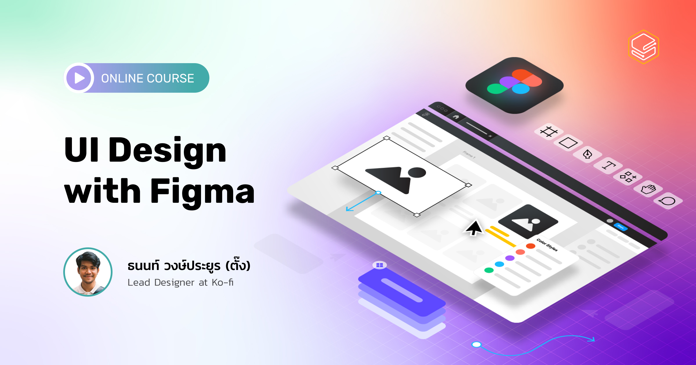

การออกแบบ User Interface (UI Design) สำหรับ Digital Product ในปัจจุบัน ต่างไปจากการออกแบบสิ่งพิมพ์ โปสเตอร์ หรือกราฟิกดีไซน์ในอดีต เพราะจำเป็นต้องออกแบบให้ Responsive เพื่อตอบสนองกับรูปแบบ Device ต่างๆ ที่ User มี ต้องออกแบบโดยคำนึงถึงระบบปฏิบัติการต่างๆ แล้ว การคำนึงถึงการทำงานร่วมกันทั้งในทีมและต่างทีมยังเป็นอะไรที่ไม่ควรมองข้ามเป็นอย่างยิ่ง

เริ่มต้นงานออกแบบของคุณอย่างมืออาชีพ ด้วย Design Tool ที่ร้อนแรงที่สุดแห่งยุคอย่าง Figma โปรแกรมออกแบบ UI ที่สามารถใช้งานได้ฟรีและออกแบบมาเพื่อการทำงานร่วมกันระหว่างทีมอย่างแท้จริง ทำให้คุณสามารถทำงานร่วมกับเพื่อนร่วมทีมผ่านเว็บไซต์ หรือจะติดตั้งโปรแกรมก็ทำได้ไม่ยาก ผ่านคอร์ส Figma ที่อัดเนื้อหาสุดเข้มข้นที่คุณจะได้เรียนตั้งแต่

- ใช้งานคำสั่งพื้นฐาน และเทคนิคในการใช้งาน Figma
- วิธีปรับแต่งรูป และสร้าง Icon ด้วย Figma
- พื้นฐานการออกแบบเบื้องต้น ที่จะทำให้คุณเข้าใจหลักการสร้าง Component ต่างๆ
- ออกแบบ UI ของ Web และ App ให้รองรับความ Responsive ในแต่ละ Devices
- ลงมือสร้าง Design system เพื่องานออกแบบที่มีประสิทธิภาพมากยิ่งขึ้น
- การใช้งาน Plug-in ใน Figma ที่จะทำให้งานออกแบบง่ายกว่าที่เคย
- การทำ Prototype อย่างง่ายไปจนถึงการใส่ Transition และ Animation ต่างๆ

โดยเนื้อหาในหลักสูตรนี้ เป็นการปรับปรุงเนื้อหาให้คุณสามารถใช้งาน Figma 2022 ได้อย่างถูกต้อง ครบถ้วนมากยิ่งขึ้น!

**Figma คืออะไร?**
Figma หนึ่งใน Design Tools ที่มาแรงที่สุดแห่งปี โดยมีฟีเจอร์การใช้งานที่หลากหลาย ทั้งด้านงาน Graphic Design และงาน UX/UI Design

[อ่านบทความเพิ่มเติมได้ที่นี่](https://blog.skooldio.com/figma-ui-design-tool/?utm_source=skooldio&utm_medium=course-detail&utm_campaign=designing-with-figma&utm_content=section-intro)

โดยโปรแกรม Figma นี้ สามารถทำได้ตั้งแต่การสร้างงาน Design พื้นฐาน, การปรับแต่งรูป, การออกแบบองค์ประกอบพื้นฐาน หรือ การสร้าง Elements ต่างๆ ที่จะมารวมเป็น Component เพื่อนำมาวางเป็น Layout ในแต่ละหน้าของ UI ไม่ว่าจะเป็นสำหรับ Website หรือ Application

โปรแกรม Figma ยังช่วยให้คุณออกแบบตัว UI Design ให้มีความ Responsive กันในทุกๆ Device ได้อย่างสมบูรณ์ รวมไปถึงฟีเจอร์การทำ Prototype เพื่อให้ User หรือทีมอื่นๆ ทดลองเล่นได้แบบ Real-time นอกจากนี้ Designer ยังสามารถส่งตัว Styling Code ให้ Developer รับไปพัฒนาต่อจากงาน Design ของเราได้แบบไม่ยาก

และที่สำคัญที่สุดคือ Figma เป็นโปรแกรมฟรี! ที่คุณไม่จำเป็นต้องลงโปรแกรมอื่นๆเพิ่ม ทั้งยังให้คุณทำงานได้ผ่านเว็บ และช่วยให้การส่งต่องานระหว่างทีมเป็นไปได้อย่างง่ายดาย และมีประสิทธิภาพ!

**ทำไมต้อง Figma?**

- ใช้ได้ทั้งบนระบบ Mac และ Windows
- ส่งต่อไฟล์กันง่ายแค่แชร์ link เพราะใช้งานบนเว็บ
- ออกแบบสะดวกและรวดเร็วด้วย Auto Layout พร้อมรองรับ Responsive ตามขนาด Device
- Plugin เพิ่มประสิทธิภาพการทำงานมากมาย
- ออกแบบและส่งต่อ Design System ได้ไม่ยาก
- ทำ Prototype ได้เสมือนจริง และแสดงผลได้ Real-time

**สิ่งที่จะได้รับจากคอร์สออนไลน์นี้**

- ใช้งาน Figma ในการออกแบบได้อย่างมีประสิทธิภาพ
- เข้าใจพื้นฐานการออกแบบ UI
- ออกแบบ UI สำหรับเว็บหรือแอปได้ด้วยตนเอง
- ออกแบบรองรับความ Responsive ใน Devices ต่างๆ
- จัดระเบียบการออกแบบด้วย Design System ในงานออกแบบของตัวเอง
- ทำ Prototype เว็บหรือแอปของตัวเองได้

### Intro to Course

| ตอนที่ | หัวข้อ                               | วีดีโอ |
| :----: | ------------------------------------ | :----: |
|   1    | Welcome to Class                     |   []   |
|   2    | What and Why Figma                   |   []   |
|   3    | Start Screen and Course Introduction |   []   |

### Figma Foundation

| ตอนที่ | หัวข้อ                       | วีดีโอ |
| :----: | ---------------------------- | :----: |
|   1    | Get Start with Figma         |   []   |
|   2    | Frame                        |   []   |
|   3    | Grids and Rulers             |   []   |
|   4    | Text                         |   []   |
|   5    | Install font helper          |   []   |
|   6    | Shapes and Radius            |   []   |
|   7    | Fill                         |   []   |
|   8    | Stroke                       |   []   |
|   9    | Shadow and Effect            |   []   |
|   10   | Images                       |   []   |
|   11   | Masking                      |   []   |
|   12   | Alignment and Distribution   |   []   |
|   13   | Group, Frame and Constraints |   []   |
|   14   | Icon                         |   []   |
|   15   | Recap                        |   []   |

### Style System

| ตอนที่ | หัวข้อ                | วีดีโอ |
| :----: | --------------------- | :----: |
|   1    | Intro to Style System |   []   |
|   2    | Color Style           |   []   |
|   3    | Text System           |   []   |
|   4    | Shadow Style          |   []   |
|   5    | Grid Style            |   []   |

### Auto Layout

| ตอนที่ | หัวข้อ                                 | วีดีโอ |
| :----: | -------------------------------------- | :----: |
|   1    | Button and Padding                     |   []   |
|   2    | Plugin - Unsplash and Material Symbols |   []   |
|   3    | Button with Icon and Space Between     |   []   |
|   4    | Responsive Card                        |   []   |
|   5    | Recap                                  |   []   |

### Component and Property

| ตอนที่ | หัวข้อ                          | วีดีโอ |
| :----: | ------------------------------- | :----: |
|   1    | Intro to Component and Property |   []   |
|   2    | Component                       |   []   |
|   3    | Text Property                   |   []   |
|   4    | Instance Swap                   |   []   |
|   5    | Boolean                         |   []   |
|   6    | Variants                        |   []   |
|   7    | Recap                           |   []   |

### Hands-on Project

| ตอนที่ | หัวข้อ       | วีดีโอ |
| :----: | ------------ | :----: |
|   1    | Introduction |   []   |
|   2    | Solution     |   []   |

### Design Systems

| ตอนที่ | หัวข้อ                 | วีดีโอ |
| :----: | ---------------------- | :----: |
|   1    | Component based Design |   []   |
|   2    | Introduction           |   []   |
|   3    | Text                   |   []   |
|   4    | Color                  |   []   |
|   5    | Icon                   |   []   |
|   6    | Tab                    |   []   |
|   7    | Button                 |   []   |
|   8    | Card                   |   []   |
|   9    | Navigation             |   []   |
|   10   | Solution               |   []   |

### Prototying

| ตอนที่ | หัวข้อ                         | วีดีโอ |
| :----: | ------------------------------ | :----: |
|   1    | Introduction                   |   []   |
|   2    | Link                           |   []   |
|   3    | Fix Position when Scrolling    |   []   |
|   4    | Horizontal and Vertical Scroll |   []   |
|   5    | Swapping and State             |   []   |
|   6    | Modal                          |   []   |
|   7    | Loading State                  |   []   |
|   8    | Smart Animation                |   []   |
|   9    | Recap                          |   []   |

### Collaborate Function

| ตอนที่ | หัวข้อ                                   | วีดีโอ |
| :----: | ---------------------------------------- | :----: |
|   1    | Share with Team and Handoff to Developer |   []   |
|   2    | Comment                                  |   []   |
|   3    | Version Control                          |   []   |
|   4    | Share Team Libraries                     |   []   |
|   5    | Widget                                   |   []   |
|   6    | Export and Save File                     |   []   |

### Tip, Tricks, and Plug-in

| ตอนที่ | หัวข้อ                     | วีดีโอ |
| :----: | -------------------------- | :----: |
|   1    | Batch Styler and Similayer |   []   |
|   2    | Google Sheet Sync          |   []   |
|   3    | Stark                      |   []   |

### Final Project

| ตอนที่ | หัวข้อ     | วีดีโอ |
| :----: | ---------- | :----: |
|   1    | Conclusion |   []   |
