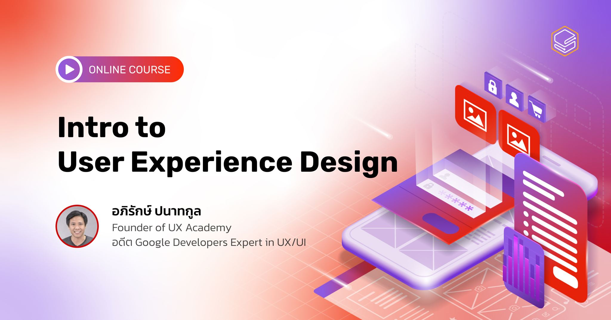

ทุกวันนี้มีคนจำนวนมากเริ่มได้ยินว่า UX (User Experience) นั้นสำคัญ ยิ่งในโลกยุคดิจิทัลสายงานด้าน UX/UI ก็เป็นที่ต้องการของตลาดมากขึ้น และมีรายได้สูง

ทำให้หลายคนอยากผันตัวมาทำงานสายนี้ ซึ่งในแต่ละธุรกิจก็มีการตีความหมายของคำว่า UX แตกต่างกันไป จนบางครั้งอาจสร้างความสับสนว่า UX design คืออะไร คนที่ทำตำแหน่งงาน UX Designer ต้องทำอะไรบ้าง แล้วการทำงานของ UI Designer กับ Graphic Designer เหมือนหรือต่างกันอย่างไร

ซึ่งในคอร์ส Intro to User Experience Design (UX) นี้เราจะมาทำความเข้าใจ เพื่อให้เห็นภาพขึ้นว่าที่จริงแล้วหน้าที่หลักของ UX Designer คืออะไร และมีการทำงานอย่างไร?

**ทำไมต้องเรียนคอร์ส Intro to User Experience Design (UX)**

คนที่ทำงานเกี่ยวกับ Digital Product ตลอดจนการพัฒนา Software จะทราบกันดีอยู่แล้วว่าผู้ใช้งานสำคัญ แต่อาจไม่รู้ว่าจะทำความเข้าใจผู้ใช้งานได้อย่างไร ไม่รู้ว่ามีอะไรบ้างที่ต้องคำนึงถึง เพื่อลดความเสี่ยงจากความผิดพลาดในการพัฒนาผลิตภัณฑ์

โดยปกติเวลาเริ่มทำ Software มักเริ่มต้นที่ “เราจะทำโปรแกรมอะไร และโปรแกรมนั้นมี Feature อะไรบ้าง” ทั้งที่ควรจะเริ่มต้นที่ผู้ใช้คือใคร เค้ามีปัญหาอะไร และผลิตภัณฑ์ของเราจะแก้ปัญหาให้เค้าได้อย่างไร

หลักคิดนี้มักพบใน Design Thinking Workshop ซึ่งเน้นกระบวนการทำความเข้าใจผู้ใช้ กระบวนการค้นหาปัญหาของผู้ใช้ การทำงานเป็นทีมเพื่อหา Idea สุดท้าย จากนั้นนำไปทำการทดสอบและปรับปรุงให้ดีขึ้นเรื่อย ๆ

มาเรียนรู้ทักษะ UX ที่ถูกต้อง ให้คุณได้เข้าใจวิธีคิดของคนทำงาน UX อย่างแท้จริง พร้อมนำไปออกแบบประสบการณ์ผู้ใช้งานเพื่อความสำเร็จทางธุรกิจ

**ในหลักสูตร Intro to User Experience Design คอร์สนี้**

จะเน้นไปที่การฝึกปฏิบัติการพัฒนา Digital Product ซึ่งแตกต่างจากการออกแบบสินค้าหรือร้านค้าทั่วไป เพราะเป็นผลิตภัณฑ์ที่มีการเปลี่ยนแปลงอย่างรวดเร็วตามความต้องการของผู้ใช้งาน จึงมีต้นทุนในการออกแบบและพัฒนาที่มากน้อยแตกต่างออกไป

คอร์ส UX นี้จะพาคุณไปเรียนรู้กระบวนการออกแบบต่างๆ ที่ใช้ในงานของ UX Designer ผ่านการทำความเข้าใจผู้ใช้งาน ไม่ว่าจะเป็น Lean UX, Google Design Sprint, Service Design Toolkit และ 5 องค์ประกอบสำคัญในการทำ User Experience รวมไปถึงการนำ UX ไปใช้ในกระบวนการพัฒนาผลิตภัณฑ์ขององค์กรร่วมกับตำแหน่งงานอื่นๆ เช่น Developer หรือผู้ดูแลด้าน Business ภายในองค์กร เพื่อให้พัฒนาผลิตภัณฑ์ได้ตอบโจทย์ผู้ใช้งานและวัตถุประสงค์ขององค์กรมากยิ่งขึ้น

ด้วยการสอนรูปแบบใหม่ ที่จะทำให้คุณเข้าใจเนื้อหาเหมือนเรียนสอนสดตลอดเวลากับผู้เชี่ยวชาญตัวจริง! ผ่านการจำลองสถานการณ์ต่าง ๆ และตัวอย่างเคสมากมาย

**หลังเรียนจบคอร์สนี้คุณจะสามารถ...**

- ข้าใจลักษณะการทำงานของ UX Designer และมุมมองต่าง ๆ ในบริบทของผู้ใช้งานอย่างแท้จริง เพื่อการออกแบบที่ถูกใจผู้ใช้งานมากยิ่งขึ้น
- ออกแบบกระบวนการทำงาน เพื่อลดความเสี่ยงจากความผิดพลาดในการพัฒนา Digital Product ได้
- ออกแบบกระบวนการเพื่อเชื่อมคนในทีมเข้าด้วยกัน
- สร้างตัวแทนของผู้ใช้งาน (Persona) และการเดินทางของผู้ใช้งาน (User Journey) ได้
- สามารถนำความรู้ไปปรึกษาหารือกับทีมงานอื่น ๆ เช่น Programmer, Designer, ลูกค้า (Clients) และบริษัทที่จ้างพัฒนา เพื่อให้เข้าใจกลุ่มเป้าหมายหรือผู้ใช้งานได้
- อธิบายการทำงานที่สอดคล้องกับการตลาดในยุคดิจิทัลได้
