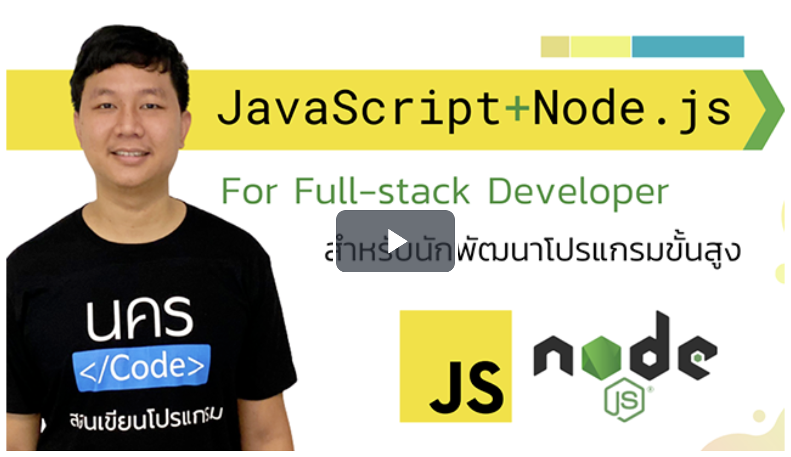

คำอธิบายคอร์สออนไลน์
ในคอร์สเรียนนี้ จะเป็นการสอนใช้งานและพัฒนาโปรแกรมด้วยภาษา JavaScript และ Node.js ฉบับจัดเต็ม เจาะลึกทุกเนื้อหา เพื่อปูพื้นฐานไปใช้งาน Framework อื่น ๆ เพิ่มเติมอย่างง่าย พร้อมรับคำแนะนำต่าง ๆ ในอาณาจักร Node.js ซึ่งเป็นเนื้อหาสำคัญสำหรับสายงานพัฒนาโปรแกรม อย่าง Front-end Web Developer หรือ Back-end Web Developer ที่ถ้าทำทั้งสองอย่างได้จะถูกเรียกว่า Full-stack Developer หมายถึงเพียงคนเดียว จะสามารถทำเว็บไซต์ได้ทั้งระบบ รวมทั้งการพัฒนาโปรแกรมอย่างอื่นด้วย เช่น Desktop Application, Mobile Application, Gaming เป็นต้น

ประโยชน์ที่ผู้เรียนจะได้รับ
- สามารถเข้าใจวิธีการสร้าง Application เป็นของตัวเองทุก ๆ Platform
- เข้าใจวิธีการใช้งาน JavaScript และ Node.js อย่างเต็มรูปแบบ สอนเปิดอ่านเอกสารเพื่อหลังเรียนจบจะได้เข้าใจแนวทางมากขึ้น
- สามารถนำความรู้ไปต่อยอดกับ Framework ได้หลายตัวสบาย ๆ เช่น React, Vue, Angular, Express.js, NestJS, MongoDB, Electron, Cordova, IoT หลาย ๆ อย่าง พร้อมรับคำแนะนำเพิ่มเติมสำหรับการเรียนรู้ต่อ
- เข้าใจแนวทางปฎิบัติทุกด้านกับการใช้ภาษา JavaScript และ Node.js อย่างถูกต้อง ป้องกันปัญหาต่าง ๆ ที่ผู้สอนเคยผ่านมา แนะนำอย่างละเอียด
- มีสูตรโกงกว่า 26 หน้ากระดาษ A4 สามารถพิมพ์ได้ ช่วยสรุปโค้ดให้แบบสั้น ๆ (เท่าที่จะสั้นได้ เพราะมีเนื้อหาเยอะเช่นกัน)
- มี Workshop เล็ก ๆ สอนประกอบการเรียนหลาย ๆ ช่วง เพื่อเสริมสร้างทักษะและฝึกคิดด้วยตนเอง ก่อนที่จะฟังเฉลย
- เหมาะกับสายงาน Full-stack Developer ที่สนใจการใช้งานทาง JavaScript โดยเฉพาะ ทำให้ใช้ภาษาเดียวจบครบทุกวงการได้
- ได้รับสิทธิ์กับการสอบถามผ่านผู้สอนโดยตรง ผ่าน Facebook: นครโค้ด (@nakorncode)

ใครควรเรียนคอร์สออนไลน์นี้
- นักเรียน หรือนักศึกษา ที่กำลังศึกษาหัวข้อการพัฒนาโปรแกรมต่าง ๆ
- บุคคลทั่วไป ที่สนใจอยากมี Application จากการสร้างด้วยตนเอง
- ผู้ที่ต้องการทำงานสายงาน Full-stack Developer หรือผู้ที่อยากเป็นฟรีแลนซ์ รับงานทั่วไปได้

ผู้เรียนต้องมีความรู้อะไรมาก่อน
- การใช้งาน HTML และ CSS ในระดับพื้นฐาน สามารถเรียนคอร์สเรียนก่อนหน้าได้ที่ https://www.skilllane.com/courses/nakorncode-html-css
- ทักษะการใช้งานคอมพิวเตอร์ และคณิตศาสตร์ ในระดับประถมเป็นต้นไป
- ทักษะการใช้ภาษาอังกฤษ ในการอ่านและเขียนระดับพื้นฐาน (สามารถใช้ Google Translate ช่วยเหลือได้)

:::note
Cheat Sheet : [Download](./Document/javascript_nodejs/JavaScript_Node.js_Cheatsheet_NakornCode.pdf)
:::

### บทนำ

| ตอนที่ | หัวข้อ                |             วีดีโอ             |
| :----: | --------------------- | :----------------------------: |
|   1    | แนะนำคอร์สเรียน JavaScript + Node.js     | [] |

### บทที่ 1 javascript

| ตอนที่ | หัวข้อ                |             วีดีโอ             |
| :----: | --------------------- | :----------------------------: |
|   1    | Getting Started - เริ่มต้นการใช้งาน JavaScript     | [] |
|   2   |  Variable - ระบบตัวแปรใน JavaScript   | [] |
|   3   |  Type System - ระบบประเภทข้อมูลของแต่ละภาษาโปรแกรม   | [] |
|   4   |  Data Types - ประเภทข้อมูลใน JavaScript   | [] |
|   5   |  Number - ข้อมูลจำนวน   | [] |
|   6   |  String - ข้อมูลตัวอักขระและข้อความ   | [] |
|   7   |  Interaction - การปฏิสัมพันธ์กับผู้ใช้งานโดยพื้นฐาน   | [] |
|   8   |  Array - ข้อมูลหลายมิติ   | [] |
|   9   |  Object - ข้อมูลเชิงวัตถุ   | [] |
|   10   |  Compare Object - ปัญหาการเปรียบเทียบข้อมูล Object ต่าง ๆ   | [] |
|   11   |  Logic (if-else) - การเปรียบเทียบข้อมูล และการทำเงื่อนไข   | [] |
|   12   |  Logic (Shorthand) - การทำเงื่อนไขแบบสั้นลง   | [] |
|   13   |  Logic (switch-case) - การทำเงื่อนไขด้วยคำสั่ง switch-case   | [] |
|   14   |  Logic (Strict comparison) - การเทียบค่าแบบ Strict   | [] |
|   15   |  Logic (Default value) - การใช้เงื่อนไขเพื่อทำค่าเริ่มต้น   | [] |
|   16   |  Variable Scope - แนวทางใช้งานตัวแปรในขอบเขตต่าง ๆ   | [] |
|   17   |  Loop (while) - การวนจำนวนรอบตามเงื่อนไข    | [] |
|   18   |  Loop (do...while) - การวนจำนวนรอบแบบดำเนินก่อน ตรวจสอบภายหลัง   | [] |
|   19   |  Loop (for) - การวนจำนวนรอบแบบตามจำนวนข้อมูลที่แน่นอน    | [] |
|   20   |  Loop (Nested) - การวนจำนวนรอบแบบหลายขั้นลำดับ   | [] |
|   21   |  Loop (break, continue) - คำสั่งพิเศษสำหรับการหยุดหรือข้ามลูป   | [] |
|   22   |  Function - การสร้างชุดคำสั่งและวิธีการใช้งาน   | [] |
|   23   |  Built-in Function & window Object - การใช้ฟังก์ชันที่มีให้ และวัตถุใน window   | [] |
|   24   |  Function Expression - ฟังก์ชันแบบนิรนาม   | [] |
|   25   |  Rest & Spread Parameter - การใช้พารามิเตอร์ร่วมกับข้อมูล Array   | [] |
|   26   |  Destructuring Assignment - การคลายข้อมูลจาก Array, Object ออกมาเป็นตัวแปรต่าง ๆ   | [] |
|   27   |  Error Handler (throw, try, catch, finally) - จัดการปัญหาต่าง ๆ ที่อาจจะเกิดขึ้นในโค้ด   | [] |
|   28   |  Callback - การทำฟังก์ชันเรียกคืน เมื่อพร้อมใช้งาน และเทคนิคการจัดการปัญหา   | [] |
|   29   |  Object-oriented Programming (OOP) - การเขียนโปรแกรมเชิงวัตถุ   | [] |
|   30   |  OOP (Prototype) - การใช้ Prototype เพื่อดัดแปลงฟังก์ชันที่มีอยู่   | [] |
|   31   |  OOP (Getter/Setter) - การใช้ผู้ตั้งข้อมูลและกำหนดข้อมูลเป็นฟังก์ชัน   | [] |
|   32   |  OOP (Extends) - การต่อเติม Class ต่าง ๆ เข้าด้วยกัน   | [] |
|   33   |  Binding - การผูกมัดข้อมูลระหว่างฟังก์ชัน   | [] |
|   34   |  Recursive, Chaining - เทคนิคการใช้ฟังก์ชันอย่างต่อเนื่องรูปแบบต่าง ๆ   | [] |
|   35   |  Promise, Async/Await - การใช้ Asynchronous ใน JavaScript ฉบับสมบูรณ์   | [] |
|   36   |  Promise Methods - คำสั่งเพิ่มเติมที่มีใน Promise    | [] |

### บทที่ 2 Document Object Model (DOM) 

| ตอนที่ | หัวข้อ                |             วีดีโอ             |
| :----: | --------------------- | :----------------------------: |
|   1    |  Document Object Model (DOM) - บทนำการใช้งานโค้ด JavaScript เพื่อสร้างปฏิสัมพันธ์กับหน้าเว็บ HTML และ CSS   | [] |
|   2    |  Event - การตรวจสอบเหตุการณ์ที่จะเกิดขึ้นในหน้าเว็บ และดำเนินการใช้ Callback ตามเหตุการณ์ต่าง ๆ   | [] |
|   3    |  Attribute - การแก้ไขข้อมูล Attribute บน HTML   | [] |
|   4    |  Style - การแก้ไขข้อมูลบน CSS   | [] |
|   5    |  Class - การแก้ไขข้อมูล Class Attribute บน HTML   | [] |
|   6    |  Dataset - การใช้ข้อมูลพิเศษ เพื่อเชื่อมต่อระหว่าง HTML และ JavaScript   | [] |
|   7    |  Position - การเรียกข้อมูลตำแหน่ง HTML Element ต่าง ๆ   | [] |
|   8    |  Node, Element - การสร้าง HTML Element ขึ้นมาใหม่ และแก้ไขลงในหน้าเว็บผ่านโค้ด JavaScript   | [] |
|   9    |  Debugger - การตรวจสอบข้อมูล และค้นหาความผิดพลาดผ่าน Web Browser   | [] |

### บทที่ 3 JavaScript Methods & Utilities

| ตอนที่ | หัวข้อ                |             วีดีโอ             |
| :----: | --------------------- | :----------------------------: |
|   1    | Number - การดำเนินการกับข้อมูล Number   | [] |
|   2    | String - การดำเนินการกับข้อมูล String   | [] |
|   3    | Regular Expression - วิธีการเรียกข้อความเฉพาะส่วนที่ต้องการ   | [] |
|   4    | Array - การดำเนินการข้อมูลกับ Array   | [] |
|   5    | Object - การดำเนินการข้อมูลกับ Object   | [] |
|   6    | Math - การใช้ฟังก์ชันทางคณิตศาสตร์    | [] |
|   7    | Date - การใช้ฟังก์ชันเพื่อกำหนดวันเวลา   | [] |
|   8    | Timer - การใช้ฟังก์ชันกำหนดช่วงเวลา   | [] |
|   9    | URL - การใช้ฟังก์ชันเพื่อกำหนดรูปแบบ URL   | [] |
|   10    |  File Reader - การใช้ฟังก์ชันเพื่ออ่านไฟล์  | [] |
|   11    |  Fetch - การใช้ฟังก์ชันสำหรับเรียกใช้งาน HTTP (RESTful API) จากผู้อื่น  | [] |
|   12    |  Storage - การใช้ฟังก์ชันควบคุมข้อมูลที่เก็บผ่าน Web Browser  | [] |
|   13    |  Geolocation - การใช้ฟังก์ชันรับสถานที่ของอุปกรณ์  | [] |

### บทที่ 4 JavaScript Libraries (Modules) 

| ตอนที่ | หัวข้อ                |             วีดีโอ             |
| :----: | --------------------- | :----------------------------: |
|   1    |  jQuery - เปลี่ยนให้ JavaScript เป็นโค้ดที่สั้นลง  | [] |
|   2    |  Lodash - ฟังก์ชันช่วยเหลือเพิ่มเติม เพื่อจัดการกับชุดข้อมูล  | [] |
|   3    |  Numeral.js - จัดการกับข้อมูลตัวเลขเพิ่มเติม  | [] |
|   4    |  Luxon - จัดการกับข้อมูลวันและเวลาเพิ่มเติม  | [] |
|   5    |  Vanilla Lazyload - การทำให้หน้าเว็บเร็วขึ้นด้วยเทคนิค Lazyload  | [] |
|   6    |   NProgress - การเพิ่มแถบแสดงสถานะการโหลดบนหน้าเว็บ | [] |
|   7    |  SweetAlert2 - การเพิ่มกล่องข้อความที่สวยงามกว่าเดิม  | [] |
|   8   |   ECharts - การแสดงกราฟและข้อมูลเชิงสถิติต่าง ๆ บนหน้าเว็บ  | [] |
|   9    |  DataTables (Vanilla) - การใช้ชุดข้อมูลตารางที่จัดการข้อมูลดีกว่าเดิม  | [] |
|   10    | Quill - การใช้ Rich Text Editor เพื่อทำให้กล่องข้อความแทรกชุดรูปแบบได้   | [] |
|   11    |  Swiper - การสร้างรูปแบบเคลื่อนไหวด้วยการปัดหน้าจอ หรือเป็นภาพสไลด์ต่าง ๆ  | [] |
|   12    |  Tippy.js - การแสดง Tooltip ข้อความลอยบนหน้าเว็บ  | [] |
|   13    |  Masonry - การจัดเรียงรูปแบบแกลลอรี่  | [] |
|   14    |  simpleParallax.js - การทำภาพแบบพารัลแลกซ์  | [] |
|   15    |   JavaScript Framework - ทำความรู้จักกับ Framework อื่น ๆ เพิ่มเติม  | [] |
|   16    |  Tampermonkey (UserScript) - การสร้างสคริปส์ด้วยตนเองเพื่อเปิดใช้บน Web Browser  | [] |

### บทที่ 5 Node.js 

| ตอนที่ | หัวข้อ                |             วีดีโอ             |
| :----: | --------------------- | :----------------------------: |
|   1    |  Node.js - บทนำการใช้งาน Node.js  | [] |
|   2    |   Installation - การติดตั้งและใช้งาน  | [] |
|   3    |   Global Object - ข้อมูล Object ที่ใช้งานได้ทั่วไปบน Node.js | [] |
|   4    |  CommonJS & ECMAScript Module - ระบบโมดูลใน JavaScript  | [] |
|   5    |  Debugger - การใช้ Debug บน Node.js  | [] |
|   6    |  util - ฟังก์ชันเสริมสำหรับคุณสมบัติเพิ่มเติม   | [] |
|   7    |  path - การกำหนดเส้นทางของไฟล์และโฟลเดอร์   | [] |
|   8    |  fs - การอ่านและแก้ไขไฟล์ในระบบ   | [] |
|   9    |  Event-driven - การกำหนดเหตุการณ์ต่าง ๆ   | [] |
|   10    |  Streaming - การนำข้อมูลอ่านและเขียนแบบ Stream  | [] |
|   11    |  HTTP (GET) - การเรียกข้อมูล HTTP (RESTful API) ผ่าน Node.js   | [] |
|   12    |  HTTP (POST) - การส่งข้อมูลแบบ POST ผ่าน Node.js  | [] |
|   13    |  Pipeline - การอ่านและเขียนไฟล์ร่วมกับ Steam   | [] |

### บทที่ 6 Node Package Management (NPM) 

| ตอนที่ | หัวข้อ                |             วีดีโอ             |
| :----: | --------------------- | :----------------------------: |
|   1    |  NPM - การจัดการโมดูลในโปรเจคของเรา  | [] |
|   2    |  Publish - การส่งโมดูลออกไปยัง Registry ของ npmjs.com  | [] |
|   3    |  eslint - การใช้ Linter เพื่อช่วยเหลือจัดรูปแบบโค้ดให้เหมือนกันทั้งโปรเจค  | [] |
|   4    |  dotenv - การกำหนด Environment Variable ผ่านไฟล์   | [] |
|   5    |  http-server - สร้างเว็บเซิร์ฟเวอร์จำลองผ่าน Node.js  | [] |
|   6    |  commander - การสร้าง CLI อย่างง่ายสำหรับการรับข้อมูลเมื่อใช้คำสั่งต่าง ๆ   | [] |
|   7    |  enquirer - วิธีทำแบบฟอร์มลงใน CLI  | [] |
|   8    |  cli-table - การแสดงผลแบบตารางใน CLI  | [] |
|   9    |  axios - การเรียก HTTP (RESTful API) ต่าง ๆ ที่ง่ายกว่าเดิม   | [] |
|   10    |  validator - ฟังก์ชันช่วยเหลือการตรวจสอบ String   | [] |
|   11    |  uuid - การสร้างรหัสไอดีแบบไม่ซ้ำกัน  | [] |
|   12    |  glob - การเลือกไฟล์และโฟลเดอร์ในรูปแบบ Glob  | [] |
|   13    |  xlsx - อ่านและสร้างเอกสาร Spreadsheet (Microsoft Office Excel)  | [] |
|   14    |  pdfmake - การสร้างเอกสาร PDF ด้วย Node.js  | [] |
|   15    |  sharp - แก้ไขและแปลงไฟล์รูปภาพผ่าน Node.js  | [] |
|   16    |  ffmpeg - แก้ไขและแปลงไฟล์วิดีโอผ่าน Node.js  | [] |
|   17    |  archiver - การบีบอัดไฟล์เป็น .zip  | [] |
|   18    |  @fakerjs/faker - การสร้างข้อมูลสุ่มสำหรับจำลองข้อมูล  | [] |
|   19    |  pm2 - การบริหารจัดการทรัพยากร และการรันระบบต่าง ๆ ใน Node.js  | [] |

