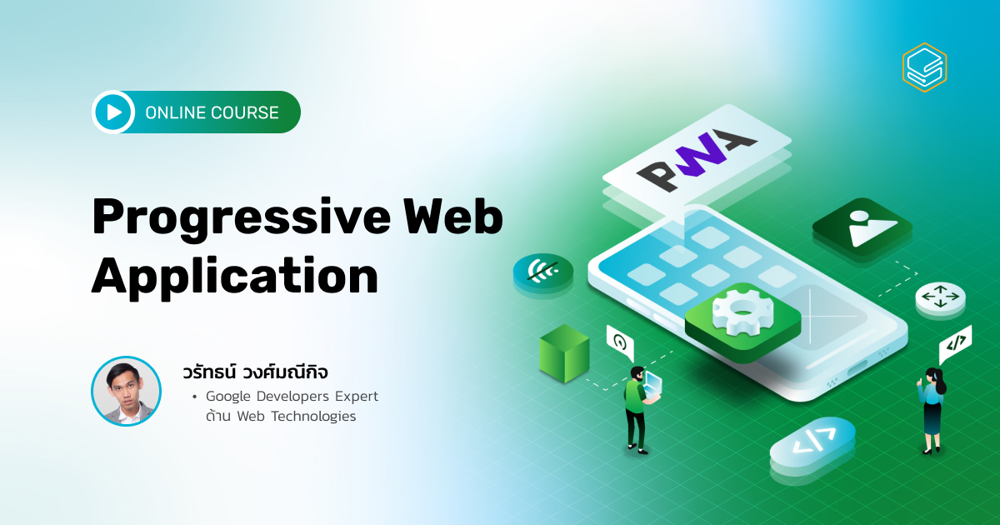

Progressive Web Application (PWA) คืออะไร?
การพัฒนา Application ด้วยคอนเซ็ปท์ Progressive Web Application (PWA) ซึ่งเป็นแนวคิดในการพัฒนาเว็บไซต์ที่สามารถให้ประสบการณ์เช่นเดียวกับ Mobile Application ได้

ข้อดีคือช่วยให้สามารถพัฒนาได้ในเวลาที่รวดเร็ว ใช้ทรัพยากรน้อยกว่า เมื่อเทียบกับการพัฒนา Mobile App รูปแบบ Native และไม่จำกัดการเข้าถึงและการติดตั้งบน Platforms (Apple App Store / Google Play store)

ด้วยคุณสมบัติดังกล่าว ทำให้บริษัทต่างๆ สนับสนุนแนวคิด และ เริ่มพัฒนา App ด้วยแนวคิดของ Progressive Web Apps กันมากขึ้น อาทิเช่น Starbucks, Tinders, Rakuten, Twitter และองค์กรระดับโลกอีกมากมาย ทำให้แนวคิดการพัฒนาเว็บรูปแบบ Progressive Web Apps เป็นรูปแบบในการพัฒนา App ที่จะเป็นแนวทางหลักของโลก Techology ในอนาคตที่ทุกองค์กรจะขาดไม่ได้

ภายในคอร์ส "Progresssive Web Application" นี้จะพาคุณเรียนรู้ทุกเรื่องในการพัฒนา Progressive Web Apps ตั้งแต่ พาเข้าใจองค์ประกอบของ Progressive Web Apps ว่าประกอบไปด้วยอะไรบ้าง? แนะนำเทคนิคการปรับแต่งประสบการณ์ Appให้การใช้งานลื่นไหลไม่ติดขัด สอนการใช้ Feature ต่างๆ เพื่อ Integrate Progressive Web Apps กับ Platform เพื่อสามารถสร้างประสบการณ์ของผู้ใช้งานได้แนบเนียนที่สุด สอนวิธีการพัฒนาให้ Progressive Web Apps เรียกใช้ข้อมูลหลังบ้านอย่างไรให้ลื่นไหลที่สุดเมื่อการใช้งาน App อยู่ในสถานะ Offline จนจบกระบวนการนำ Progressive Web Apps ไป Deploy ขึ้น Web Store ใช้งานได้จริง

คอร์สออนไลน์ Progressive Web Application

- คอร์สนี้จะเน้นปูพื้นฐานในการพัฒนา Progressive Web Apps แบบครบ จบทุกประเด็นที่ควรรู้รวมอยู่ภายในคอร์สเดียว
- รวมเทคนิคการ Customize ด้วยเครื่องมือ และ Features ต่างๆ ที่จะทำให้คุณพัฒนา Progressive Web Apps ที่สามารถสร้างประสบการ์ณใช้งานใกล้เคียงกับ Native Apps แบบแนบเนียนที่สุด
- เพิ่มแนวคิดการใช้ Progressive Web Apps ในด้านเทคนิคและด้านธุรกิจในโลกการทำงานจริง คุณจะสามารถนำไปใช้ต่อยอดได้
- อัดแน่นไปด้วยแบบฝึกหัดที่คุณจะได้ลงมือทำจริง! ด้วยตัวคุณเองในทุกบทเรียน เรียบจบได้ Certificate และผลงานส่วนตัว 1 Project
- สอนโดยผู้เชี่ยวชาญระดับ Google Developers Expert ด้าน Web Technologies

เมื่อเรียนจบคอร์สนี้ คุณจะสามารถ..

- เข้าใจภาพรวมของ Progressive Web Apps ว่าคืออะไร มีความสำคัญอย่างไร และมีวิธีการพัฒนาอย่างไรแบบละเอียดทุกขั้นตอน
- สามารถ Setting และ Customizeให้ “เว็บไซต์” มีลักษณะคล้ายกับ “แอปฯ” มากที่สุด ทั้งด้านหน้าตาและฟีเจอร์ใช้งาน
- มีเทคนิคการเชื่อมต่อ Platform ให้เว็บของคุณสามารถทำงานได้อย่างเรียบเนียนที่สุด
- เรียนรู้การใช้ App Manifest ซึ่งถือว่าเป็นหัวใจสำคัญของการทำ Progressive Web Apps
- ติดตั้งและใช้งาน Service Worker ที่จะทำให้เว็บมีฟีเจอร์สำคัญต่างๆ เช่น สามารถทำงานได้แม้อุปกรณ์ Offline, การทำ Push Notification หรือ การทำ Background Sync รวมถึงฟีเจอร์อื่นๆ อีกมากมาย
- เห็นภาพการใช้งานจริงทั้งด้านเทคนิคและด้านธุรกิจจากตัวอย่าง Case Study ของ Progressive Web Apps กับบริษัทต่างๆ ที่ยกมาภายในคอร์ส
- มีผลงาน Progressive Web Apps เป็นของตัวเอง เก็บเป็น Portfolio ส่วนตัว

### Course Introduction

| ตอนที่ | หัวข้อ              | วีดีโอ |
| :----: | ------------------- | :----: |
|   1    | Course Introduction |   []   |

### What is & Why Progressive Web App?

| ตอนที่ | หัวข้อ                             | วีดีโอ |
| :----: | ---------------------------------- | :----: |
|   1    | What is & Why Progressive Web App? |   []   |

### Foundation of Progressive Web App

| ตอนที่ | หัวข้อ                | วีดีโอ |
| :----: | --------------------- | :----: |
|   1    | Foundations & Tools   |   []   |
|   2    | Rendering             |   []   |
|   3    | Responsive & Foldable |   []   |
|   4    | Debugging Tools       |   []   |
|   5    | Performance           |   []   |

### App Manifest

| ตอนที่ | หัวข้อ                                 | วีดีโอ |
| :----: | -------------------------------------- | :----: |
|   1    | App Manifest                           |   []   |
|   2    | Anatomy of Manifest & Handling Updates |   []   |

### App Manifest

| ตอนที่ | หัวข้อ                 | วีดีโอ |
| :----: | ---------------------- | :----: |
|   1    | Application Appearance |   []   |
|   2    | Icon                   |   []   |
|   3    | Theme Color            |   []   |
|   4    | Splash Screen          |   []   |
|   5    | Display Mode           |   []   |
|   6    | Darkmode               |   []   |

### Installation Experience

| ตอนที่ | หัวข้อ                                    | วีดีโอ |
| :----: | ----------------------------------------- | :----: |
|   1    | Installation Experience                   |   []   |
|   2    | Customizing Installation Dialog           |   []   |
|   3    | Detecting Whether Native App is Installed |   []   |

### Offine

| ตอนที่ | หัวข้อ                          | วีดีโอ |
| :----: | ------------------------------- | :----: |
|   1    | Offline & Detect Online Status  |   []   |
|   2    | Service Worker                  |   []   |
|   3    | Service Worker with Workbox     |   []   |
|   4    | Precache Using Workbox          |   []   |
|   5    | Routing Cache Using Workbox     |   []   |
|   6    | Offline Storage                 |   []   |
|   7    | LocalStorage and SessionStorage |   []   |
|   8    | IndexDB                         |   []   |
|   9    | Cache API                       |   []   |
|   10   | Storage Limit                   |   []   |

### Platform Integration

| ตอนที่ | หัวข้อ                 | วีดีโอ |
| :----: | ---------------------- | :----: |
|   1    | Introduction           |   []   |
|   2    | App Shortcut           |   []   |
|   3    | Web Push Notifications |   []   |
|   4    | Badging API            |   []   |
|   5    | Media Session API      |   []   |
|   6    | Web Share              |   []   |
|   7    | Web Share Target       |   []   |
|   8    | Enter Key Hint         |   []   |
|   9    | Contact API            |   []   |

### Deploy to Store

| ตอนที่ | หัวข้อ                   | วีดีโอ |
| :----: | ------------------------ | :----: |
|   1    | Deploy PWA to the Stores |   []   |

### Case Studies

| ตอนที่ | หัวข้อ       | วีดีโอ |
| :----: | ------------ | :----: |
|   1    | Case Studies |   []   |

### Course Recap

| ตอนที่ | หัวข้อ       | วีดีโอ |
| :----: | ------------ | :----: |
|   1    | Case Studies |   []   |
