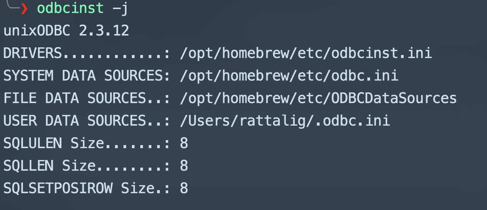

## Setup Homebrew

link URL(https://brew.sh/)

- Install Homebrew
```bash
/bin/bash -c "$(curl -fsSL https://raw.githubusercontent.com/Homebrew/install/HEAD/install.sh)"
```

## Setup ODBC

- Install UnixODBC
```bash
brew install unixodbc
```

- Install Driver for IBM DB2

[Download IBMiAccess_v1r1_macOS_AP](https://metrosystemso365-my.sharepoint.com/:u:/g/personal/rattalig_metrosystems_co_th/EXlwL2wALPdDjB3A9PO3z8wB6kRzYBU2wa80XmCMsUjmOg?e=GPVQBt "download") 

- Check ODBCINST

```bast 
odbcinst -j
```



- set DSN in USER DATA SOURCES..: /Users/rattalig/.odbc.ini

```bash
[METRO240]
Trace=yes
TraceFile=odbc.log
Description=ODBC Connect EDUPGMR
Driver=IBM i Access ODBC Driver
System = 172.16.1.240
UserID = MAX
Password = MAXKUB
Naming = 0
DefaultLibraries = MAXLIB
```
- Check DSN List

```bash
odbcinst -q -s
```


- Test ODBC With ISQL

```bash
isql -v [DSN][USer][Password]
```


## Setup FTP

```bash
brew install inetutils
```

## Setup Isuzu VPN

- Install GlobalProtect

[Download GlobalProtect-5.2.12](https://metrosystemso365-my.sharepoint.com/:u:/g/personal/rattalig_metrosystems_co_th/Ec9pdRDj_9BLjtG19fgmIPAB925Oy8L3Vr2E7y4JCOgLZw?e=p9yj5b "download") 

- Install Cert

[Download Certificate](https://metrosystemso365-my.sharepoint.com/:u:/g/personal/rattalig_metrosystems_co_th/ES2NTJp38K5Ji6BNLFtPlz8BqEu6nx4xaLceVolUo5-2vQ?e=M0J2OQ "download")

