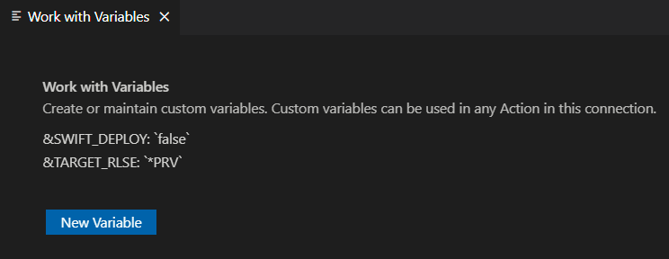

You can create custom variable to use in your "Command to run" strings. To access custom variables:

Use <kbd>F1</kbd>, then search for "IBM i Custom variables":


---

Or from the User Library List browser:


---

In the **Work with Variables** tab, click on **New Variable** to add your variable.

Click on a custom variable to change it or delete it.



---

Here we are adding a variable named `&TARGET_RLSE`.

Press Save and the list of custom variables is shown.


---

#### _Example Usage_

In all the CRTBNDxxx actions add TGTRLS(&TARGET_RLSE), like this:

```CL
?CRTBNDCL PGM(&OPENLIB/&OPENMBR) SRCFILE(&OPENLIB/&OPENSPF) OPTION(*EVENTF) DBGVIEW(*SOURCE)  TGTRLS(&TARGET_RLSE)
```

Now a single change to the TARGET_RLSE custom variable can impact all the CRTBNDxxx actions.
