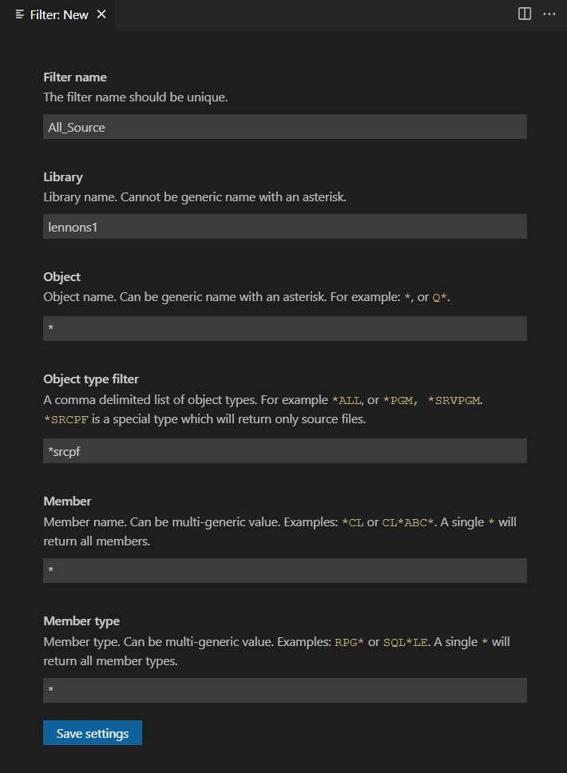
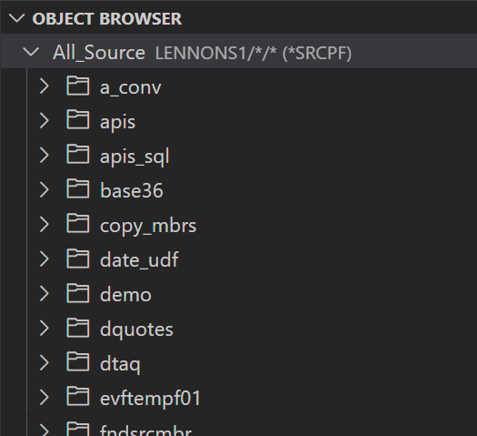
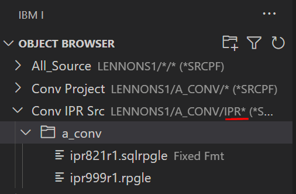

The Object Browser allows you to interact with libraries, files, source files, programs and other types of objects. Subset the objects you want to work with by creating a filter or filters.

### Create First Filter

Click on the **+ Create new filter** prompt to create your first filter (or click on the filter icon):

---

Complete the new filter dialog. The explanatory text in the Create Filter dialog explains the options.

**Click 'Save settings' to create the new filter.**

---

The above filter example lists all source files in library `LENNONS1`:

:::info
The filter name has the filter definition to the right.
:::

---

### Create Additional Filters

    To create another filter, click the filter icon to open up the new filter dialog.

---

### Create Quick Filters

To quickly create filters without having to fill out the filter dialog, click on the **Create Quick Filter** icon. When prompted, enter a filter that matches one of the following formats:

- `LIB*`
- `LIB/OBJ/MBR.MBRTYPE (OBJTYPE)`

:::info
All parameters except the library are optional. For parameters which are not provided, the same defaults as the filter dialog will be used.
:::

### Maintaining Filters

Changing a filter definition is quick and easy. Just right click on the filter and chose **Maintain filter** to open up the filter dialog. Or chose **Delete filter** to remove the filter definition.

---

### Filter Examples

**Single File Filter**

**Subsetted source member example**

A single source file files subsetting just some members:

**Non Source Example**

Some programs in a library:

