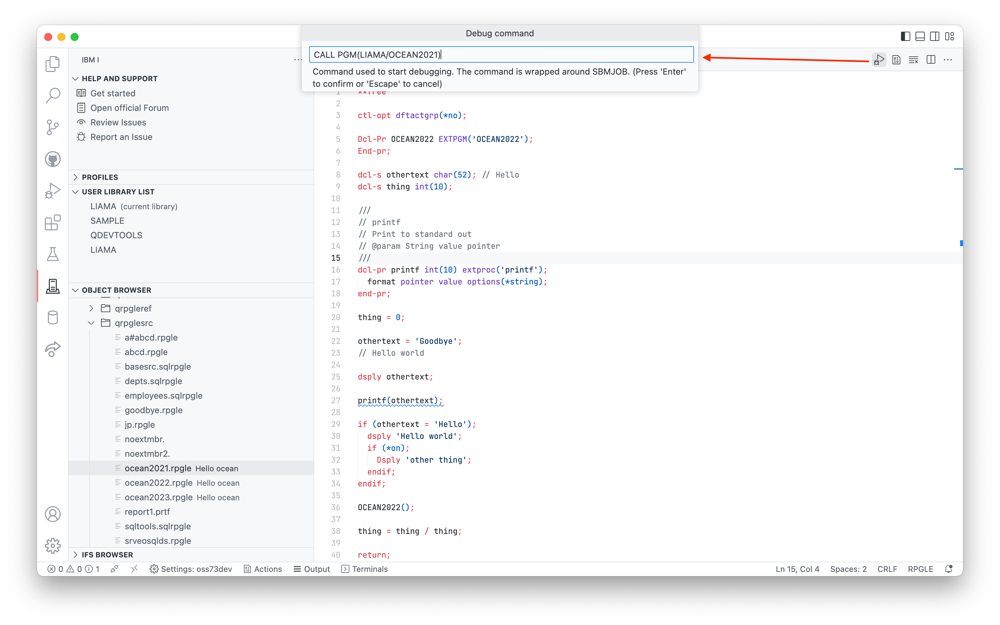
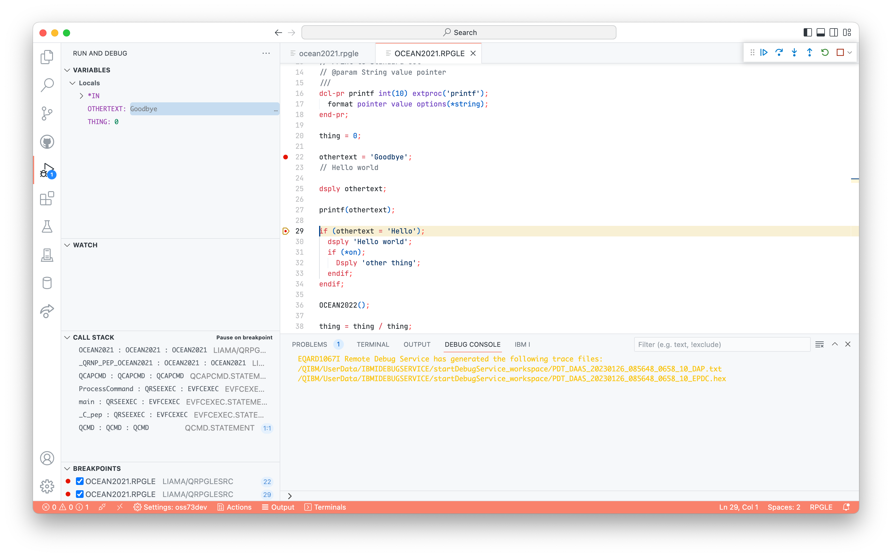
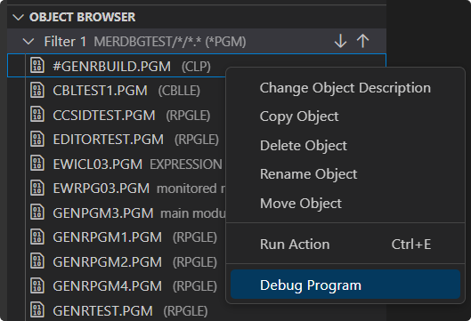
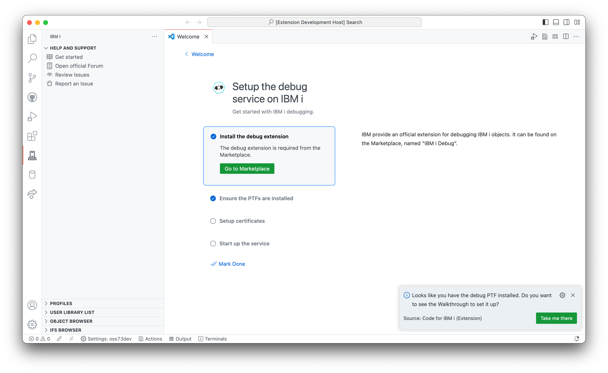
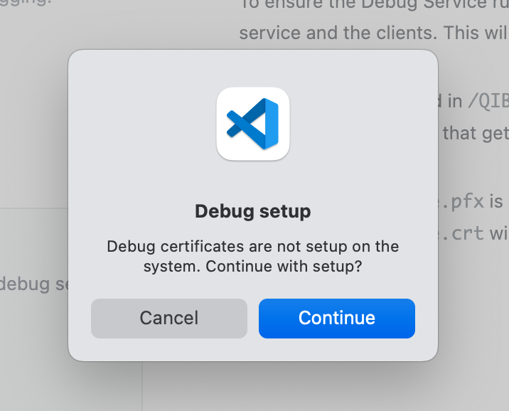
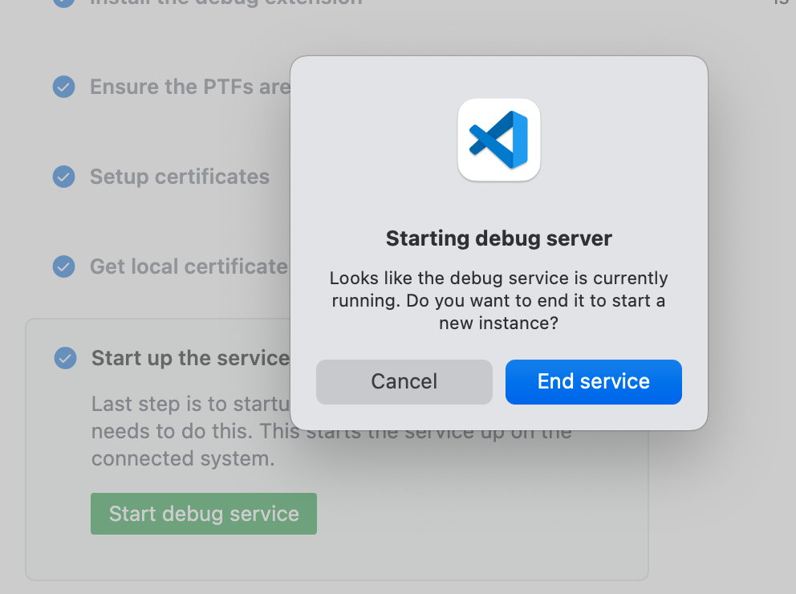
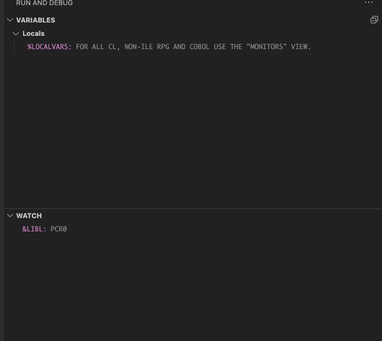
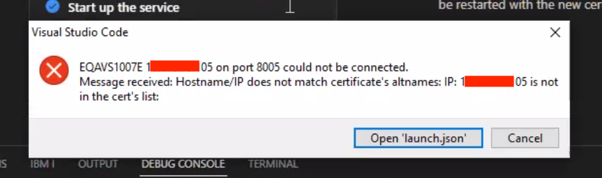

import Tabs from '@theme/Tabs';
import TabItem from '@theme/TabItem';

# ILE Debugging

Debugging ILE programs is now available inside of Visual Studio Code. We've added UI to make sure setting up the Debug Service to be a swift process.

# Starting to debug

After configuring the Debug Service, launching a debug session is a click of a button away. When you have active source open, a new Debug button will appear in the navigation bar. Breakpoints can be set prior to debugging, or during the debugging session.



---

Clicking the Debug button will display an input box which will allow the user to customise the command which starts the debug job. This allows the developer to pass in parameters, or call another program to launch the debug session.

After the debug session has started, every session will break on entry. You can read more about the debugging UI on the [Debug actions section on the Visual Studio Code documentation](https://code.visualstudio.com/docs/editor/debugging#_debug-actions).



---

To debug a program from the Object Browser, right-click on the program object and select the **Debug Program** option. Like before this will also display an input box to modify the command which starts the debug job.



# Configuring the debugger

## General requirements

- PTFs
- Certificates setup on the server
  - created in `/QIBM/UserData/IBMiDebugService/certs` by default
- IBM i Debug extension
  - installed into Visual Studio Code
- Local client certificate
  - can be imported with the 'Import local certificate' command

## Required PTFs

To make use of the Debug Service, you need the following PTFs:

<Tabs>
<TabItem label="Version 1" value="Version 1">

- Host debugger in 5770SS1:
  - IBM i 7.5 PTF SI83666 and SI81035
  - IBM i 7.4 PTF SI83683 and SI81031
  - IBM i 7.3 PTF SI83692 and SI80858
- Java 8 is required
  - `/QOpenSys/QIBM/ProdData/JavaVM/jdk80/64bit`

</TabItem>
<TabItem label="Version 2" value="Version 2">

- _Version 2 not yet released._
- Java 11 is required
  - `/QOpenSys/QIBM/ProdData/JavaVM/jdk11/64bit`

</TabItem>
</Tabs>

After you have installed the PTFs, the connection inside of Visual Studio Code will need to be restarted.

## Configuring & starting the service

After connecting to a system in Code for IBM i, if the PTFs are installed but the service is not configured (i.e. the certificates don't exist) you will see a notice asking if you'd like to open the Walkthrough to configure the Debug Service. Clicking the button will open the Walkthrough.



:::info
There only needs to be one instance of the Debug Service running and therefore the certificates should only be generated once. All developers share the Debug Service.
:::

---

### Generating certificates

This Walkthrough can easily configure the Debug Service and start it up. The last steps have buttons to 'Generate certificates' and 'Start debug service'. Running them in order will do all the work to setup the service.

_It will ask you to confirm the initialisation._

If certificates already exist on the server, you may see a slightly different message as Code for IBM i will not replace existing certificates.



---

### Starting the server

The 'Start debug service' button will spin up the Debug Service. If the Debug Service is already running, it will ask you if you want to end the existing instance before starting a new one - this is a requirement if you have generated new certificates on the server. It is not recommended to run two instances of the Debug Service at once.



You can also start the Debug Service through the command palette:


---

## Debug Service ports

The Debug Service depends on three ports by default:

- Port 8001 (unsecure port)
  - this port is not used for anything in regards to debugging, though it is required to start and stop the Debug Service
- Port 8005 (secure port)
  - this port is used by all debugging clients and is required to start the Debug Service.
- Port 8008
  - this port is used for Service Entry Breakpoint (_only applies to version 2 of the Debug Service_)

While you can configure the ports in the Connection Settings, it is recommended the defaults are used for consistency.

# FAQ

### What's the difference between the Debug Service and Debug Server?

As depicted in this diagram, the client (VS Code, IBM i Debug) connects to the Debug Service, which talks to the Debug Server.

- The Debug Service is started up inside of Visual Studio Code as documented above. In the future it will also be possible to start it from Navigator for i.
- The Debug Server is started up with `STRDBGSVR`. You may get an error message in VS Code if you attempt to debug when the Debug Server is not running.


### I can't see the variables when debugging CL

This is a limitation for CL. The local variables will not show up in the Variables view for CL. You can add a local variable to the Watch view to inspect its value. The CL limitation also exists in RDi.

[See GitHub issue here](https://github.com/codefori/vscode-ibmi/issues/1069).



# Common issues

## Debug hangs

There is a [known issue](https://github.com/codefori/vscode-ibmi/issues/1059)that when you start debugging from VS Code, the debugger hangs and doesn't launch.

The fix is to check if you've got a prior debug job stuck in `MSGW`. You can do this with `WRKACTJOB`, or a similar command like `WRKSBSJOB QBATCH`.

**Users should no longer face this issue** as we now submit debug jobs to `QSYSWRK` with `QSYSNOMAX`.

## `STRDBGSVR` requirement

The Debug Service that is started depends on the traditional Debug Server.


If you receive this message, do as it says. Simply start the Debug Server with `STRDBGSVR` from a greenscreen.

## IP not in cert list

**It is always recommended you use a hostname in the connection settings to make use of the debugger when in secure mode**.



_Error that is shown when connecting to the debugger if connecting using an IP address._

This error occurs when the hostname used to connect to the debugger (which might be the IP address that was configured in the connection settings) is not the same as the host name created as part of the certificate.

If you are using a system that doesn't have a host name (for example `YOURSYSTEM`, or `pub400.com`), then an entry should be added to your device's 'hosts' file. This entry should be the same on all devices in your network to ensure that everyone is using the same hostname.

- Windows: `c:\Windows\System32\Drivers\etc\hosts`
- Mac: `/etc/hosts`

Your entry might look like this:

```txt title="hosts" {2}
# IP HOSTNAME
192.168.0.20 MYIBMI
```

If you find that you've added your local hostname entry and the error is still occurring, then you may need to delete the existing certificates from `/QIBM/ProdData/IBMiDebugService/bin/certs` on the IFS and generate them again in the Walkthrough.
