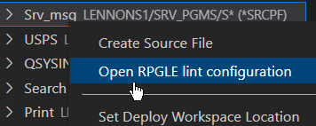

The information below is specific to the linter in the RPGLE extension.

## Opening the linter config

Use `vscode-rpgle.openLintConfig` to open the rules configuration for the source you're working in.


Or you can right click on a library filter:



If a linter rules file does not exist, you will be asked asked if you want to create one. The created file will provide some default rules, as below.

## Relative lint config

* If you are developing in source members (`LIB/QRPGLESRC/MYSOURCE.RPGLE`)
   * the the linter config exists in `LIB/VSCODE/RPGLINT.JSON`. 
   * Each library has its own rules configuration file, binding it to all RPGLE sources in that library. 
   * config changes get pickup when RPGLE sources are re-opened.
* When developing in the IFS:
   * linter rules config exist in `.vscode/rpglint.json` relative to the current working directory.
   * config changes get pickup when RPGLE sources are re-opened.
* When developing in a local workspace
   * linter rules exist in `.vscode/rpglint.json` relative to the workspace.
   * Local RPGLE gets scanned automatically when config is changed

## Lint options

Below are some available lint configs. [See the `rpglint.json` schema for the most up to date rules](https://github.com/codefori/vscode-rpgle/blob/main/schemas/rpglint.json).

| Type | Rule | Value | Description |
|---|---|---|---|
| 🌟 | indent | number | Indent for RPGLE. |
| 🌟 | BlankStructNamesCheck | boolean | Struct names cannot be blank (*N). |
| 🌟 | QualifiedCheck | boolean | Struct names must be qualified (QUALIFIED). |
| 🌟 | PrototypeCheck | boolean | Prototypes can only be defined with either EXT, EXTPGM or EXTPROC |
| 🌟 | ForceOptionalParens | boolean | Expressions must be surrounded by brackets. |
| 🌟 | NoOCCURS | boolean | OCCURS is not allowed. |
| 🤔 | NoSELECTAll | boolean | 'SELECT *' is not allowed in Embedded SQL. |
| 🌟 | UselessOperationCheck | boolean | Redundant operation codes (EVAL, CALLP) not allowed. |
| 🌟 | UppercaseConstants | boolean | Constants must be in uppercase. |
| 🌟 | IncorrectVariableCase | boolean | Variable names must match the case of the definition. |
| 🌟 | RequiresParameter | boolean | Parentheses must be used on a procedure call, even if it has no parameters. |
| 🌟 | RequiresProcedureDescription | boolean | Procedure titles and descriptions must be provided. |
| 🌟 | StringLiteralDupe | boolean | Duplicate string literals are not allowed. |
| 🌟 | RequireBlankSpecial | boolean | *BLANK must be used over empty string literals. |
| 🌟 | CopybookDirective | string | Force which directive which must be used to include other source. (`COPY` or `INCLUDE`) |
| 🌟 | DirectivesCase | string | Directives must be in the specified case. (`lower` or `upper`) |
| 🌟 | UppercaseDirectives | boolean | **Deprecated** use `DirectivesCase` instead. Directives must be in uppercase. |
| 🤔 | NoSQLJoins | boolean | JOINs in Embedded SQL are not allowed. |
| 🌟 | NoGlobalsInProcedures | boolean | Globals are not allowed in procedures. |
| 🌟 | SpecificCasing | array | Specific casing for op codes, declartions or built-in functions codes. |
| 🌟 | NoCTDATA | boolean | CTDATA is not allowed. |
| 🌟 | PrettyComments | boolean | Comments cannot be blank, must start with a space and have correct indentation. |
| 🌟 | NoGlobalSubroutines | boolean | Global subroutines are not allowed. |
| 🌟 | NoLocalSubroutines | boolean | Subroutines in procedures are not allowed. |
| 🌟 | NoUnreferenced | boolean | Unreferenced definitions are not allowed. |
| 🔒 | NoExternalTo | string array | Calls to certain APIs are not allowed. (EXTPROC / EXTPGM) |
| 🔒 | NoExecuteImmediate | boolean | Embedded SQL statement with EXECUTE IMMEDIATE not allowed. |
| 🔒 | NoExtProgramVariable | boolean | Declaring a prototype with EXTPGM and EXTPROC using a procedure is now allowed. |
| 🤔🌟 | IncludeMustBeRelative | boolean | When using copy or include statements, path must be relative to the root. Usage is only recommended for local/workspace projects. |
| 🤔 | SQLHostVarCheck | boolean | Warns when referencing variables in Embedded SQL that are also defined locally. | 
| 🤔 | RequireOtherBlock | boolean | Requires `SELECT` blocks to have an `OTHER` block. |

**Type key**

| Key | Value |
|---|---|
| 🌟 | Clean code |
| 🤔 | Safe code |
| 🔒 | Secure code |

### `SpecificCasing` example

This rule allows you to specify the casing required for any or all declares or BIFs.

If you want all `DCL` to be lower case and all `BIF`s to be upper case, then it would be coded like this:

```json
   "SpecificCasing":[
      {"operation": "*BIF","expected": "*upper"},
      {"operation": "*DECLARE", "expected": "*lower"}
   ]
```

If you wanted `%parms` and `%timestamp` to always be lower case, and all other BIFs to be upper case, then it would be coded like this:

```json
   "SpecificCasing": [
      {
         "operation": "%parms",
         "expected": "*lower"
      },
      {
         "operation": "%timestamp",
         "expected": "*lower"
      },
      {
         "operation": "*bif",
         "expected": "*upper"
      }
   ]
```

:::danger
   The order of entries above is important.
:::

Or, if for some reason, you wanted `%timestamp` to always be coded as `%TimeStamp` then it could be coded like this:

```json
   "SpecificCasing": [
      {
         "operation": "%parms",
         "expected": "*lower"
      },
      {
         "operation": "%timestamp",
         "expected": "*TimeStamp"
      },
      {
         "operation": "*bif",
         "expected": "*upper"
      }
   ]
```