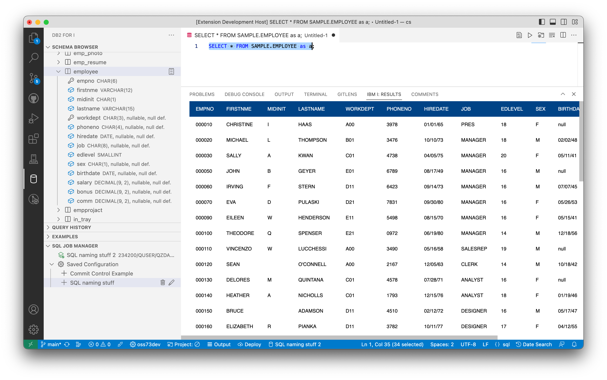
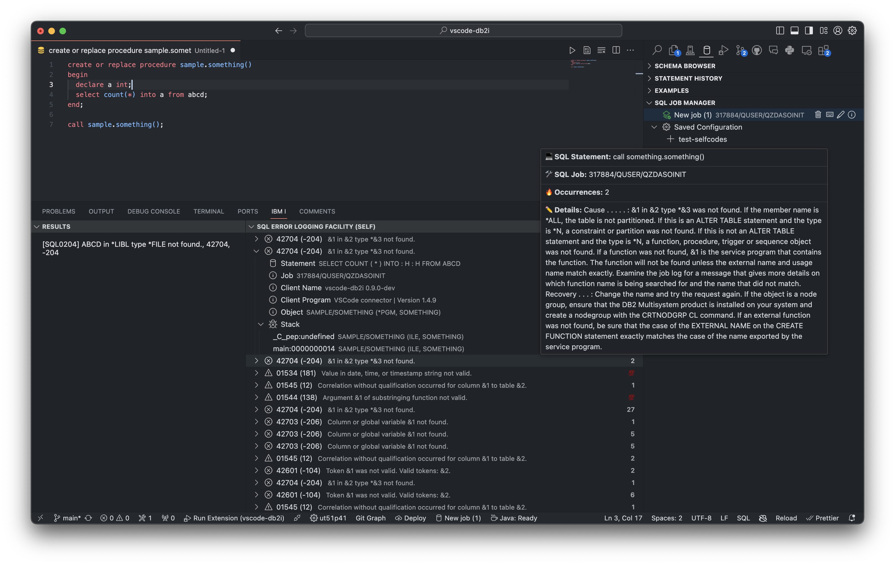
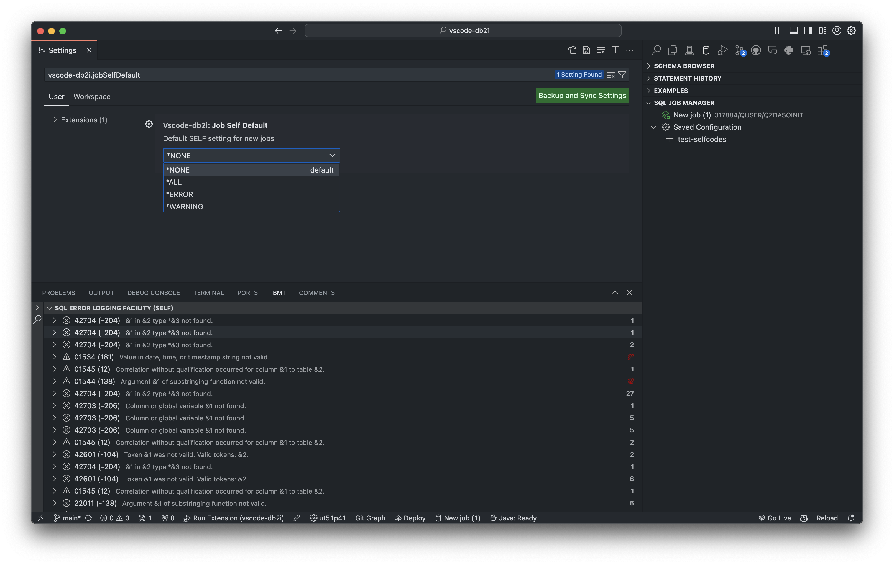
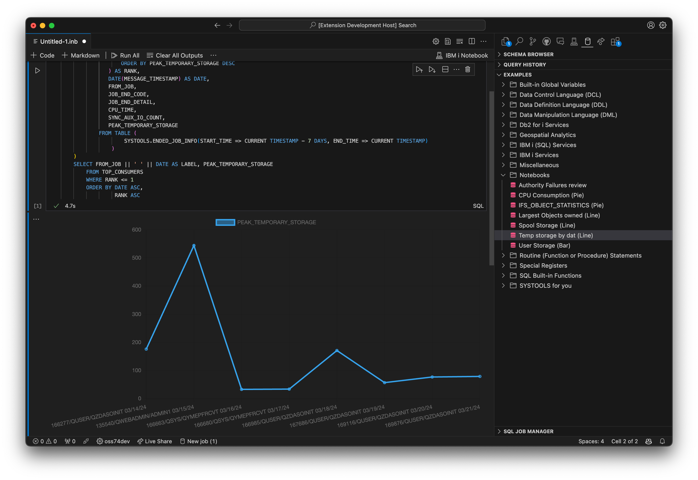

The Db2 for i extension allows users to browse database schemas, execute SQL statements, and more, on an IBM i.



## Install

The extension can be [installed from the Marketplace](https://marketplace.visualstudio.com/items?itemName=HalcyonTechLtd.vscode-db2i) and is also part of the [IBM i Development Pack](https://marketplace.visualstudio.com/items?itemName=HalcyonTechLtd.ibm-i-development-pack).

### Server Component

As of 0.3.0, the Db2 for i extension requires a server component. The component provides improved performance and makes it easy for us to add advanced features. The Db2 for i extension manages the server component installation when you connect to an IBM i with Code for IBM i and will ask the user to confirm any installation or update. The server component is installed into `$HOME/.vscode`, which means a per-user installation. [The server component is also open-source](https://github.com/ThePrez/CodeForIBMiServer).

## Executing statements

Either:

* open an existing `.sql` file (source member, streamfile or local file)
* create a new file
    1. create a file (control / command + N)
    2. change the language ID to `sql`

After you have an SQL file open, you can either:

* Move your cursor onto the statement you want to execute and:
    * use the play button in the top right to execute
    * use the shortcut (control / command + R) to execute the statement

The result set will appear below the statement. As your scroll through the result set, more data will load. When you execute an SQL statement, it will be prepended to your Query History view, where it remains readily accessible.

SQL statements are executed using the active job selected in the SQL Job Manager view.

### SQL processors

Newer version of SQL provided by Db2 for i allows you to run CL commands in a script. There are also `json`, `csv`, and `sql` processors, which will open the result set in the chosen format.

```sql
-- result set as normal table
select * from sample.employee;

-- result set as JSON, will open in a new file
json: select * from sample.employee;

-- result set as CSV, will open in a new file
csv: select * from sample.employee;

-- result set as SQL insert statement
sql: select * from sample.employee;

-- run CL commands. output is directed to IBM i output channel
cl: dspffd sample/employee
```

## SQL Job Manager

This view allows users to manage different SQL jobs, each with their own unique JDBC configuration. A new job can be created by clicking the database icon in the SQL Job Manage title bar. Or, if you have not created a new job before, there is a big button to do the same action.


Your active job will be marked with a highlighted icon. **The active job is used for all SQL statement execution**, including SQL that powers the Schema Browser, user-executed SQL statements, etc. You can change the active job by simply clicking the job you choose to use. You will see the highlighted icon change to indicate the active job.

### Editing job configuration

You can use the pencil icon on any job to edit the JDBC properties. When the Apply Changes button is pressed, any changes are saved and the job is restarted, to fully apply the changes.

You are able to right-click on any job to save those job settings, allowing it to be easily reused. Using the 'Save settings to config' right-click action will prompt you to enter a name for the configuration. Once saved, you will see a 'Saved Configuration' folder appear, with all your saved configs. Clicking on a saved config will launch a new job with those pre-defined settings. You can use the pencil icon on any saved configuration to edit it.

## Using the Schema Browser

The Db2 for i extension adds a view called Schema Browser which allows the user to add existing schemas to the list and will allow them to browse existing database objects. You can right-click on SQL objects to show more actions. Each SQL object type may have unique actions. 

### Viewing table contents

If you are using the Schema Browser to browse objects, you are able to use the 'View contents' icon when hovering over a table, view, or alias to cause a basic SQL select statement to be generated and executed.

## SQL Error Logging Facility (SELF)

SQL Error Logging Facility (SELF) offers a comprehensive view that can help users understand specific SQL errors or warnings. The SELF view can be accessed through the IBM i panel next to the Results View. 

Additional documentation of SELF can be found [here](https://www.ibm.com/docs/en/i/7.5?topic=tools-sql-error-logging-facility-self)



Each item in the SELF view is for a specific `SQLCODE` which is displayed in parenthesis. The `SQLCODE` tracks the actual error or warning triggered by a given SQL statement. 

- An error SQLCODE must be preceded by a single minus sign ('-').
- A warning SQLCODE can be preceded by an optional plus sign ('+').

When an item is expanded or hovered over, information about the `SQLCODE` is displayed such as the Job Name, Call Stack, Additional Details, and the SQL statement. The counter on the right of each item denotes the number of occurrences(🔥) of the specific `SQLCODE` . Once the number of occurrences for a given code is greater than 100, we display 💯.

### Enabling SELF in VSCode

To capture SQL errors or warnings, enable the SELF Default in your VSCode settings. This will be the Default `SYSIBMADM.SELFCODES` global variable for all jobs. By default, the `SELFCODES` level is set to *NONE.

- *ERROR specifies all SQLCODEs that are error conditions (negative values).
- *WARN specifies all SQLCODEs that are warning conditions (positive
values).
- *ALL specifies all SQLCODEs that are error or warning conditions.
- *NONE turns off SELF processing.



The SELF Level can also be set on a per job basis by right clicking on the active job in the [SQL Job Manager](#sql-job-manager)

### Auto Refresh


We added the option for users to configure `Auto Refresh` on the SELF view. When enabled, the SELF view will update on a constant interval (every 30 seconds). The SELF view can be cleared by clicking the trash icon. 

## Visual Explain

We have added Visual Explain into the database extension with a more lightweight approach of explain data. The typically run button on the document now has options to either run, run and explain or explain without running, which will show the explain nodes and node details in the same result set view.

The Visual Explain view has button on the header to control which nodes should be highlights, as well as the ability to export the data as JSON, and more.


## Notebooks

Notebooks now supports Db2 for IBM i when using the database extension. If you have not heard of Notebooks before, [check out this blog post](https://code.visualstudio.com/blogs/2021/11/08/custom-notebooks) on the Visual Studio Blog. IBM i Notebooks allow users to build documents of markdown, SQL statements and CL commands all in one view, that can be saved, re-used, re-run and shared to other people. This allows you to create documentation, a step-by-step guide, and many other things, specifically for IBM i.



:::tip
We are expecting a full release of Notebooks in vscode-db2i 1.0.0.
:::

### How to create a Notebook

There are a few ways to create an IBM i Notebook:

1. You can use the 'New Notebook' button on the SQL Job Manager
2. You can find 'IBMi i: New Notebook' in the command palette.
3. Open a `.inb` file (which stands for 'i Notebook')

**You can also find Notebook samples from the Examples view, under Notebooks.**

### The life of a Notebook

A notebook is made up of cells. A cell is asscociated with a language (for example, `sql`, `cl`, or `markdown`). Cells (other than `markdown`) can be executed. Each cell has a result and typically gets rendered below the cell input after execution.

Execution is different for each language type:

* If it is `sql`, then a table will be returned of the result set. Notebooks do not support paging - it will return all rows. The SQL statements will be executed through the selected job in the SQL Job Manager.
* If the language is `cl`, then when it is executed it will run a CL command and return the resulting output.

You are able to use the stop and play buttons on the cells to request a cancellation of the execution. There is also a 'Run All' button, which will execute all cells.

### Charting with SQL

Notebooks have the power to chart data that is returned from the database. It is most useful for rendering numerical data (on the Y axis) by another value (on the X axix). Here are the supported chart types, which are used for specifying the chart type:

* bar
* line
* doughnut
* pie
* polar area (`polarArea`)
* radar

To render a chart using SQL in a Notebook, two rules must be met:

1. You must provide the chart type (via comment tag or statement prefix)
2. There must be a `LABEL` column for the X axis.
3. One or more numeric columns for the plotted data
   * You can also provide a `_desc` string column for each numeric column to provide additional information in the tooltip
   * For numeric columns to use formatted names, provide a fixed column name: `salary as "Salary"`

Optional tags as comments can also be provided. Optional tags are formatted as so:

* `chart` - which can be used instead of the chart prefix
* `title` - appears above the chart for a title
* `y` - for a title to appear on the Y axis

```sql
bar: select
  empno as label,
  salary
from sample.employee limit 10
```

```sql
--chart: bar
select 
  empno as label, 
  salary
from sample.employee limit 10
```

```sql
--chart: bar
--y: NZD
select empno as label, 
  salary as "Salary", 'Does not include ' concat rtrim(char(bonus)) concat '\nbonus for ' concat rtrim(firstnme) as "Salary_desc"
from sample.employee limit 10
```

```sql
--title: 
--chart: line
select 
  empno as label, 
  salary, bonus
from sample.employee
order by salary asc
limit 10
```
