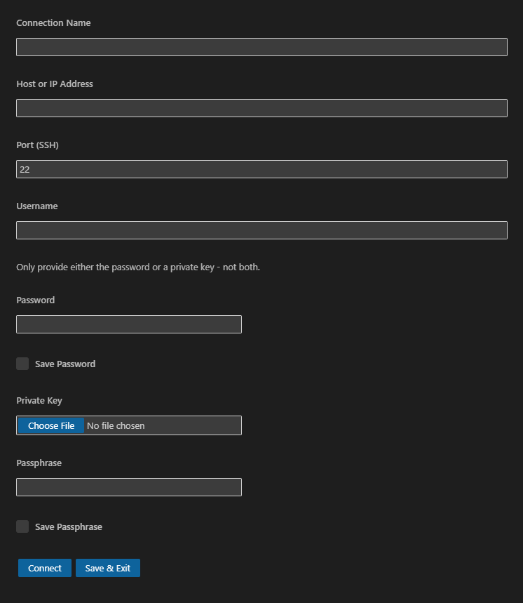
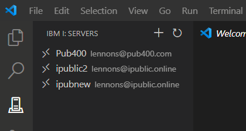
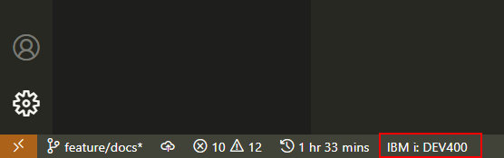
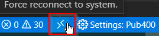

### Connect First Time

Click the IBM i icon and then 'Connect to an IBM i'.

---

Enter in the systems details in the window that appears. You need either a password or a private key.

Alternatively, press <kbd>F1</kbd>, search for `IBM i: New Connection`, and complete the above form.

### Connect Subsequent

If you have already connected to an IBM i system, click on the conection in the IBM i: Servers browser.

---

After logging in, a status bar item will appear showing the name of the IBM i system you are connected to.

### Logout (Disconnect)

To close a connection and logout out, press <kbd>F1</kbd>, search for `IBM i: Disconnect from current connection`

### Unstable Connections (Reconnect)

If your connection is unstable and is sometimes lost, check the setting "Show Reconnect Button". See _Settings: Global_, below. This will add a "Force reconnect to system" button to the task bar.

