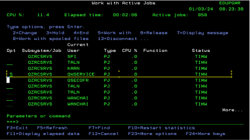
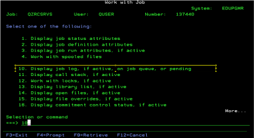
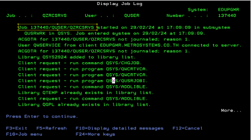

## How to display job log after run web service

```cmd
WRKACTJOB SBS(QUSRWRK) JOB(QZRCSRVS)
```

<Hilight color="blue" >User = QWSERVICE </Hilight> <br/> <br/>







## How to debug Web service

export const Hilight = ({children, color}) => (
<span
style={{
      backgroundColor: color,
      borderRadius: '20px',
      color: '#fff',
      padding: '10px',
      cursor: 'pointer',
    }}
onClick={() => {
alert(`You clicked the color ${color} with label ${children}`);
}}>
{children}
</span>
);

```cmd
STRSRVJOB 137440/QUSER/QZRCSRVS
```

<Hilight color="Red" > \*See from job after run from web service </Hilight> <br/> <br/>

```cmd
STRDBG PGM(*NONE) UPDPROD(*YES) OPMSRC(*YES) SRVPGM(&library/&servicepgm)
```

- Call API from Post man / Web page for call web service program
- reen screen will show screen start debug
- then use debug same RPGLE

```cmd
ENDSRVJOB

```

```cmd

ENDDBG
```
